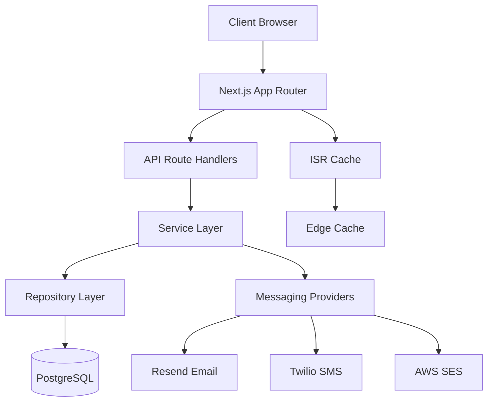
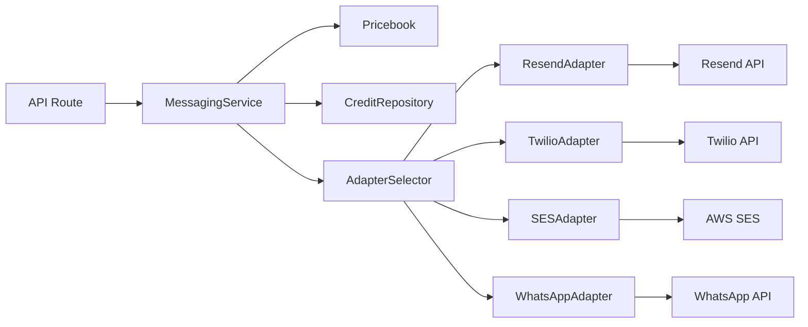

# Design Document

## Overview

This design document outlines the architecture for Planr v1.0, implementing vendor pages with SSR/ISR, RSVP system, messaging credits, and budget persistence. The system builds upon the existing Next.js 14 App Router architecture with Prisma and PostgreSQL, adding new models and services while maintaining clean separation of concerns.

## Architecture

### High-Level Architecture



### Directory Structure (Following Existing Patterns)

```
src/
├── app/                          # Next.js App Router pages
│   ├── vendors/[slug]/          # Vendor detail pages (SSR+ISR)
│   ├── rsvp/[inviteId]/         # RSVP pages
│   └── api/                     # API route handlers
│       ├── rsvp/               # RSVP endpoints
│       ├── messages/           # Messaging endpoints
│       └── public/vendors/     # Public vendor endpoints
├── features/                    # Feature-based organization
│   ├── rsvp/
│   │   ├── api/                # Handler classes
│   │   ├── service/            # Business logic
│   │   ├── repo/               # Data access
│   │   └── dto/                # Data transfer objects
│   ├── messaging/
│   │   ├── api/
│   │   ├── service/
│   │   ├── adapters/           # Provider adapters
│   │   └── pricebook.json      # Pricing configuration
│   └── vendors/                # Extend existing vendor feature
├── lib/
│   └── validation/             # Zod schemas
└── components/                 # UI components
```

## Components and Interfaces

### API Handler Pattern (Following Existing Architecture)

```typescript
// RSVP Handler following existing pattern
export class RSVPHandler {
  private service = new RSVPService()

  async submitRSVP(request: NextRequest): Promise<NextResponse> {
    try {
      const body = await request.json()
      
      // Validate with Zod
      const validation = RSVPSubmissionSchema.safeParse(body)
      if (!validation.success) {
        return NextResponse.json({
          success: false,
          error: {
            message: 'Validation error',
            details: validation.error.issues,
            statusCode: 400
          }
        }, { status: 400 })
      }

      const result = await this.service.submitRSVP(validation.data)
      
      if (!result.success) {
        return NextResponse.json({
          success: false,
          error: result.error
        }, { status: result.error?.statusCode || 500 })
      }

      return NextResponse.json({
        success: true,
        data: result.data
      }, { status: 201 })
    } catch (error) {
      return NextResponse.json({
        success: false,
        error: { message: 'Internal server error', statusCode: 500 }
      }, { status: 500 })
    }
  }
}

// Messaging Handler
export class MessagingHandler {
  private service = new MessagingService()

  async sendMessage(request: NextRequest, userId: string): Promise<NextResponse> {
    try {
      const body = await request.json()
      
      const validation = SendMessageSchema.safeParse(body)
      if (!validation.success) {
        return NextResponse.json({
          success: false,
          error: {
            message: 'Validation error',
            details: validation.error.issues,
            statusCode: 400
          }
        }, { status: 400 })
      }

      // Use userId as coupleId (following existing pattern)
      const result = await this.service.sendMessage({
        ...validation.data,
        coupleId: userId
      })

      if (!result.success) {
        return NextResponse.json({
          success: false,
          error: result.error
        }, { status: result.error?.statusCode || 500 })
      }

      return NextResponse.json({
        success: true,
        data: result.data
      })
    } catch (error) {
      return NextResponse.json({
        success: false,
        error: { message: 'Internal server error', statusCode: 500 }
      }, { status: 500 })
    }
  }
}
```

### Data Models (Extending Existing Schema)

The design extends the existing Prisma schema while maintaining compatibility:

```prisma
// Extend existing User model to support couple functionality
// User already exists, we'll use it as the couple entity

// New models to add to existing schema
model Invite {
  id        String   @id @default(uuid()) @db.Uuid
  userId    String   @db.Uuid  // Use existing User as couple
  email     String
  token     String   @unique
  country   String?  // ISO country for pricing
  createdAt DateTime @default(now())
  updatedAt DateTime @updatedAt
  user      User     @relation(fields: [userId], references: [id], onDelete: Cascade)
  rsvps     InviteRSVP[]
  
  @@map("invites")
}

model InviteRSVP {
  id         String   @id @default(uuid()) @db.Uuid
  userId     String   @db.Uuid  // Use existing User as couple
  inviteId   String   @db.Uuid
  email      String
  status     RsvpStatus  // Reuse existing enum
  partySize  Int      @default(1)
  notes      String?
  createdAt  DateTime @default(now())
  updatedAt  DateTime @updatedAt
  user       User     @relation(fields: [userId], references: [id], onDelete: Cascade)
  invite     Invite   @relation(fields: [inviteId], references: [id], onDelete: Cascade)
  
  @@unique([userId, email])
  @@map("invite_rsvps")
}

// Extend existing Budget model instead of creating new BudgetItem
// Budget model already exists with similar structure

model CreditBalance {
  userId    String   @id @db.Uuid  // Use existing User as couple
  credits   Int      @default(0)   // abstract units
  updatedAt DateTime @updatedAt
  user      User     @relation(fields: [userId], references: [id], onDelete: Cascade)
  
  @@map("credit_balances")
}

// Add slug to existing Vendor model via migration
// ALTER TABLE vendors ADD COLUMN slug VARCHAR UNIQUE;

// Update User model to include new relations
model User {
  // ... existing fields ...
  invites       Invite[]
  inviteRsvps   InviteRSVP[]
  credits       CreditBalance?
}
```

### Migration Strategy

```sql
-- Migration: Add new tables and extend existing ones
-- File: prisma/migrations/20250824_000000_rsvp_messaging_system/migration.sql

-- Add slug to vendors for public pages
ALTER TABLE vendors ADD COLUMN slug VARCHAR;
CREATE UNIQUE INDEX vendors_slug_unique ON vendors(slug) WHERE slug IS NOT NULL;

-- Create invites table
CREATE TABLE invites (
  id UUID PRIMARY KEY DEFAULT gen_random_uuid(),
  user_id UUID NOT NULL REFERENCES users(id) ON DELETE CASCADE,
  email VARCHAR NOT NULL,
  token VARCHAR UNIQUE NOT NULL,
  country VARCHAR(2),
  created_at TIMESTAMP DEFAULT NOW(),
  updated_at TIMESTAMP DEFAULT NOW()
);

-- Create invite_rsvps table
CREATE TABLE invite_rsvps (
  id UUID PRIMARY KEY DEFAULT gen_random_uuid(),
  user_id UUID NOT NULL REFERENCES users(id) ON DELETE CASCADE,
  invite_id UUID NOT NULL REFERENCES invites(id) ON DELETE CASCADE,
  email VARCHAR NOT NULL,
  status VARCHAR NOT NULL DEFAULT 'pending',
  party_size INTEGER DEFAULT 1,
  notes TEXT,
  created_at TIMESTAMP DEFAULT NOW(),
  updated_at TIMESTAMP DEFAULT NOW(),
  UNIQUE(user_id, email)
);

-- Create credit_balances table
CREATE TABLE credit_balances (
  user_id UUID PRIMARY KEY REFERENCES users(id) ON DELETE CASCADE,
  credits INTEGER DEFAULT 0,
  updated_at TIMESTAMP DEFAULT NOW()
);

-- Add indexes for performance
CREATE INDEX invites_user_id_idx ON invites(user_id);
CREATE INDEX invites_token_idx ON invites(token);
CREATE INDEX invite_rsvps_user_id_idx ON invite_rsvps(user_id);
CREATE INDEX invite_rsvps_invite_id_idx ON invite_rsvps(invite_id);
```

### Repository Layer (Following Existing Patterns)

```typescript
// Following existing BaseRepository pattern with RepositoryResult
import { BaseRepository, RepositoryResult } from '@/lib/repositories/BaseRepository'

// RSVP repository following existing pattern
export class RSVPRepository extends BaseRepository {
  async createOrUpdate(data: RSVPCreateData): Promise<RepositoryResult<InviteRSVP>> {
    try {
      // Upsert logic with idempotency
      const rsvp = await this.db.inviteRSVP.upsert({
        where: { coupleId_email: { coupleId: data.coupleId, email: data.email } },
        update: { status: data.status, partySize: data.partySize, notes: data.notes },
        create: data
      })
      return createSuccessResult(rsvp)
    } catch (error) {
      return createErrorResult('Failed to create/update RSVP', 'RSVP_UPSERT_FAILED', 500)
    }
  }

  async getStats(coupleId: string): Promise<RepositoryResult<RSVPStats>> {
    try {
      const stats = await this.db.inviteRSVP.groupBy({
        by: ['status'],
        where: { coupleId },
        _count: { _all: true },
        _sum: { partySize: true }
      })
      return createSuccessResult(this.formatStats(stats))
    } catch (error) {
      return createErrorResult('Failed to get RSVP stats', 'RSVP_STATS_FAILED', 500)
    }
  }
}

// Credit repository with atomic operations
export class CreditRepository extends BaseRepository {
  async getBalance(coupleId: string): Promise<RepositoryResult<number>> {
    try {
      const balance = await this.db.creditBalance.findUnique({
        where: { coupleId }
      })
      return createSuccessResult(balance?.credits || 0)
    } catch (error) {
      return createErrorResult('Failed to get credit balance', 'CREDIT_GET_FAILED', 500)
    }
  }

  async decrementAtomic(coupleId: string, units: number): Promise<RepositoryResult<boolean>> {
    try {
      const result = await this.db.creditBalance.updateMany({
        where: { 
          coupleId,
          credits: { gte: units }
        },
        data: {
          credits: { decrement: units }
        }
      })
      return createSuccessResult(result.count > 0)
    } catch (error) {
      return createErrorResult('Failed to decrement credits', 'CREDIT_DECREMENT_FAILED', 500)
    }
  }
}
```

### Service Layer (Following Existing Patterns)

```typescript
// Following existing service pattern with RepositoryResult
import { RepositoryResult, createErrorResult, createSuccessResult } from '@/lib/repositories/BaseRepository'

// RSVP service following existing pattern
export class RSVPService {
  private repo = new RSVPRepository()
  private inviteRepo = new InviteRepository()

  async submitRSVP(data: RSVPSubmissionData): Promise<RepositoryResult<InviteRSVP>> {
    // Validate invite exists and is active
    const inviteResult = await this.inviteRepo.getByToken(data.inviteId)
    if (!inviteResult.success || !inviteResult.data) {
      return createErrorResult('Invalid invite', 'INVALID_INVITE', 400)
    }

    // Create/update RSVP with idempotency
    return this.repo.createOrUpdate({
      coupleId: inviteResult.data.coupleId,
      inviteId: data.inviteId,
      email: data.email,
      status: data.status,
      partySize: data.partySize,
      notes: data.notes
    })
  }

  async getStats(coupleId: string): Promise<RepositoryResult<RSVPStats>> {
    return this.repo.getStats(coupleId)
  }
}

// Messaging service with existing pattern
export class MessagingService {
  private creditRepo = new CreditRepository()
  private pricebook = new PricebookService()

  async sendMessage(request: SendMessageRequest): Promise<RepositoryResult<MessageResult>> {
    // Calculate cost
    const cost = this.pricebook.getCost(request.channel, request.country)
    
    // Atomic credit decrement
    const decrementResult = await this.creditRepo.decrementAtomic(request.coupleId, cost)
    if (!decrementResult.success || !decrementResult.data) {
      return createErrorResult('Insufficient credits', 'INSUFFICIENT_CREDITS', 402)
    }

    // Send message via adapter
    try {
      const adapter = this.getAdapter(request.channel)
      const result = await adapter.send(request)
      return createSuccessResult(result)
    } catch (error) {
      // Rollback credits on failure
      await this.creditRepo.addCredits(request.coupleId, cost)
      return createErrorResult('Message send failed', 'MESSAGE_SEND_FAILED', 500)
    }
  }

  private getAdapter(channel: string): MessageAdapter {
    // Adapter selection logic
  }
}
```

### Messaging System Architecture



## Data Models

### Data Transfer Objects (Following Existing Patterns)

```typescript
// RSVP DTOs following existing validation patterns
import { z } from 'zod'

export const RSVPSubmissionSchema = z.object({
  inviteId: z.string().uuid(),
  email: z.string().email(),
  status: z.enum(['pending', 'accepted', 'declined']),
  partySize: z.number().int().min(1).max(10).default(1),
  notes: z.string().max(500).optional()
})

export const SendMessageSchema = z.object({
  channel: z.enum(['email', 'sms', 'whatsapp']),
  to: z.string().min(1),
  country: z.string().length(2).optional(),
  templateId: z.string(),
  variables: z.record(z.string()).optional()
})

export type RSVPSubmissionData = z.infer<typeof RSVPSubmissionSchema>
export type SendMessageData = z.infer<typeof SendMessageSchema>

// Response DTOs following existing pattern
export interface RSVPStats {
  total: number
  pending: number
  accepted: number
  declined: number
  totalGuests: number
}

export interface MessageResult {
  id: string
  providerMessageId: string
  status: 'sent' | 'failed'
  creditsUsed: number
}

// Vendor DTO extending existing structure
export interface PublicVendorDTO {
  id: string
  slug: string
  name: string
  category: string
  city?: string
  region?: string
  priceBand?: string
  averageRating?: number
  reviewCount?: number
  description?: string
  photos: string[]
  website?: string
  contact: {
    email?: string
    phone?: string
  }
}
```

### API Route Structure (Following Existing Patterns)

```typescript
// src/app/api/rsvp/route.ts
import { NextRequest, NextResponse } from 'next/server'
import { RSVPHandler } from '@/features/rsvp/api/rsvp.handler'

const handler = new RSVPHandler()

// POST /api/rsvp - Submit RSVP (public endpoint, no auth required)
export async function POST(request: NextRequest) {
  return handler.submitRSVP(request)
}

// src/app/api/rsvp/stats/route.ts
import { requireOnboarding, AuthenticatedRequest } from '@/lib/auth/middleware'
import { RSVPHandler } from '@/features/rsvp/api/rsvp.handler'

const handler = new RSVPHandler()

async function getHandler(request: AuthenticatedRequest) {
  return handler.getStats(request, request.user!.id)
}

export const GET = requireOnboarding(getHandler)

// src/app/api/messages/send/route.ts
import { requireOnboarding, AuthenticatedRequest } from '@/lib/auth/middleware'
import { MessagingHandler } from '@/features/messaging/api/messaging.handler'

const handler = new MessagingHandler()

async function postHandler(request: AuthenticatedRequest) {
  return handler.sendMessage(request, request.user!.id)
}

export const POST = requireOnboarding(postHandler)

// src/app/api/public/vendors/[slug]/route.ts (Public endpoint for SSR)
import { NextRequest, NextResponse } from 'next/server'
import { VendorService } from '@/features/vendors/service/vendor.service'

const service = new VendorService()

export async function GET(
  request: NextRequest,
  { params }: { params: { slug: string } }
) {
  const result = await service.getPublicVendorBySlug(params.slug)
  
  if (!result.success) {
    return NextResponse.json({
      success: false,
      error: result.error
    }, { status: result.error?.statusCode || 500 })
  }

  if (!result.data) {
    return NextResponse.json({
      success: false,
      error: { message: 'Vendor not found' }
    }, { status: 404 })
  }

  return NextResponse.json({
    success: true,
    data: result.data
  })
}
```

### Messaging Pricebook Structure

```json
{
  "channels": {
    "email": {
      "default": 1,
      "countries": {
        "NG": 1,
        "US": 1,
        "UK": 1
      }
    },
    "sms": {
      "default": 10,
      "countries": {
        "NG": 5,
        "US": 10,
        "UK": 8
      }
    },
    "whatsapp": {
      "default": 3,
      "countries": {
        "NG": 2,
        "US": 3,
        "UK": 3
      }
    }
  }
}
```

## Error Handling

### Error Types and Responses

```typescript
// Domain errors
class InsufficientCreditsError extends Error {
  constructor(required: number, available: number) {
    super(`Insufficient credits: need ${required}, have ${available}`);
    this.name = 'InsufficientCreditsError';
  }
}

class InvalidInviteError extends Error {
  constructor(inviteId: string) {
    super(`Invalid or expired invite: ${inviteId}`);
    this.name = 'InvalidInviteError';
  }
}

// API error responses
interface APIErrorResponse {
  error: {
    code: string;
    message: string;
    details?: Record<string, any>;
  };
}
```

### Logging Strategy

```typescript
interface LogContext {
  coupleId?: string;
  inviteId?: string;
  userId?: string;
  operation: string;
  metadata?: Record<string, any>;
}

// Service-level logging
logger.info('RSVP submitted', {
  coupleId: 'couple_123',
  inviteId: 'inv_456',
  operation: 'rsvp_submit',
  metadata: { status: 'yes', partySize: 2 }
});
```

## Testing Strategy

### Unit Testing Approach

```typescript
// Repository tests with test database
describe('RSVPRepository', () => {
  beforeEach(async () => {
    await setupTestDatabase();
  });

  it('should create RSVP with idempotency', async () => {
    const data = { inviteId: 'inv_1', email: 'test@example.com', status: 'yes' };
    
    const rsvp1 = await rsvpRepo.createOrUpdate(data);
    const rsvp2 = await rsvpRepo.createOrUpdate(data);
    
    expect(rsvp1.id).toBe(rsvp2.id);
  });
});

// Service tests with mocked repositories
describe('MessagingService', () => {
  it('should prevent concurrent credit depletion', async () => {
    const creditRepo = mockCreditRepository({ balance: 1 });
    const service = new MessagingService(creditRepo, mockAdapters);
    
    const promises = [
      service.sendMessage({ coupleId: 'c1', channel: 'sms', to: '+1234' }),
      service.sendMessage({ coupleId: 'c1', channel: 'sms', to: '+5678' })
    ];
    
    const results = await Promise.allSettled(promises);
    const successes = results.filter(r => r.status === 'fulfilled');
    
    expect(successes).toHaveLength(1);
  });
});
```

### E2E Testing Scenarios

```typescript
// Playwright tests
test('RSVP flow with persistence', async ({ page }) => {
  await page.goto('/rsvp/invite_123');
  
  await page.fill('[data-testid="email"]', 'guest@example.com');
  await page.selectOption('[data-testid="status"]', 'yes');
  await page.fill('[data-testid="party-size"]', '2');
  await page.click('[data-testid="submit"]');
  
  await expect(page.locator('[data-testid="success"]')).toBeVisible();
  
  // Refresh and verify persistence
  await page.reload();
  await expect(page.locator('[data-testid="status"]')).toHaveValue('yes');
});

test('Vendor page SSR and hydration', async ({ page }) => {
  // Disable JavaScript to test SSR
  await page.setJavaScriptEnabled(false);
  await page.goto('/vendors/amazing-photography');
  
  await expect(page.locator('h1')).toContainText('Amazing Photography');
  
  // Re-enable JavaScript and test hydration
  await page.setJavaScriptEnabled(true);
  await page.reload();
  
  await page.click('[data-testid="gallery-next"]');
  await expect(page.locator('[data-testid="gallery-image"]')).toBeVisible();
});
```

## Performance Considerations

### ISR Configuration

```typescript
// app/vendors/[slug]/page.tsx
export const revalidate = Number(process.env.DEFAULT_REVALIDATE_SECONDS || 900); // 15 minutes

export async function generateStaticParams() {
  // Pre-generate popular vendor pages
  const popularVendors = await vendorService.getPopularVendors();
  return popularVendors.map(vendor => ({ slug: vendor.slug }));
}
```

### Database Optimization

```sql
-- Indexes for performance
CREATE INDEX CONCURRENTLY idx_vendors_slug ON vendors(slug);
CREATE INDEX CONCURRENTLY idx_invites_token ON invites(token);
CREATE INDEX CONCURRENTLY idx_rsvps_couple_email ON invite_rsvps(couple_id, email);
CREATE INDEX CONCURRENTLY idx_budget_items_couple ON budget_items(couple_id);
```

### Caching Strategy

```typescript
// Redis caching for frequently accessed data
class CachedVendorRepository implements VendorRepository {
  async getBySlug(slug: string): Promise<VendorDTO | null> {
    const cached = await redis.get(`vendor:${slug}`);
    if (cached) return JSON.parse(cached);
    
    const vendor = await this.baseRepo.getBySlug(slug);
    if (vendor) {
      await redis.setex(`vendor:${slug}`, 300, JSON.stringify(vendor));
    }
    
    return vendor;
  }
}
```

## Security Considerations

### Input Validation

```typescript
// Zod schemas for all API inputs
export const RSVPSubmissionSchema = z.object({
  inviteId: z.string().min(1),
  email: z.string().email(),
  status: z.enum(['yes', 'no', 'maybe']),
  partySize: z.number().int().min(1).max(10),
  notes: z.string().max(500).optional()
});
```

### Rate Limiting

```typescript
// Rate limiting for messaging endpoints
const messagingRateLimit = rateLimit({
  windowMs: 15 * 60 * 1000, // 15 minutes
  max: 10, // limit each IP to 10 requests per windowMs
  message: 'Too many messaging requests'
});
```

### Data Privacy

```typescript
// Mask sensitive data in logs
function maskEmail(email: string): string {
  const [local, domain] = email.split('@');
  return `${local.slice(0, 2)}***@${domain}`;
}
```

This design provides a robust foundation for implementing the Planr v1.0 features while maintaining clean architecture, performance, and security standards.