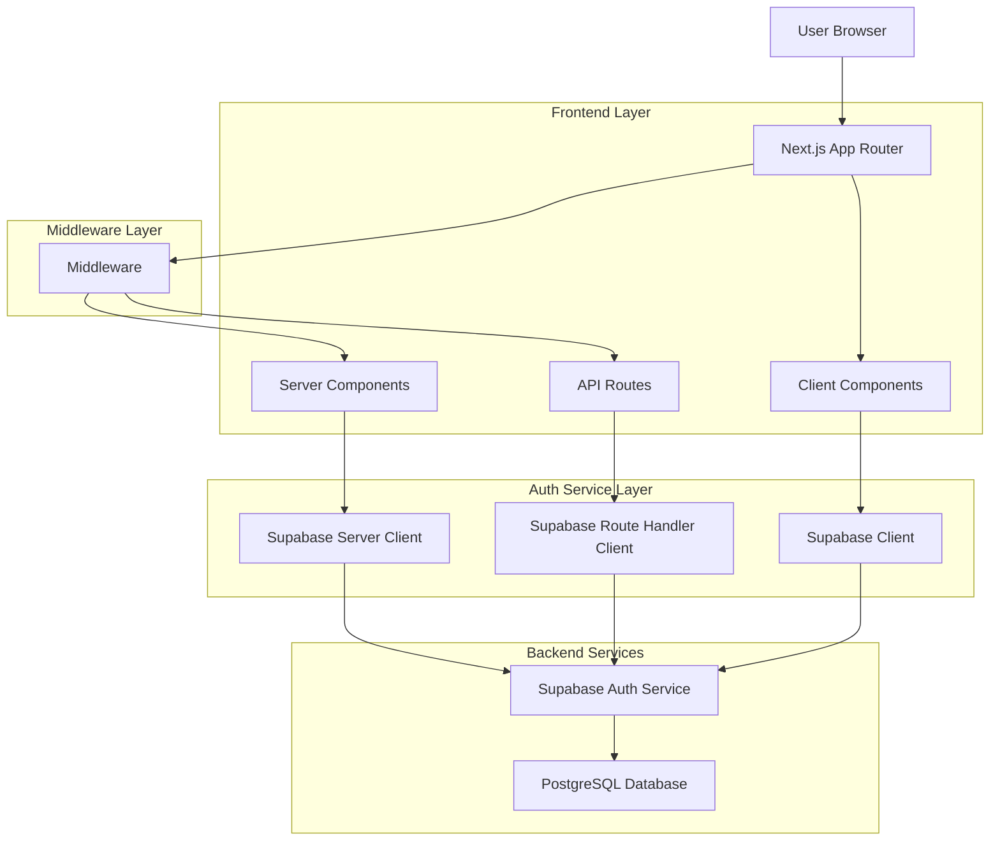
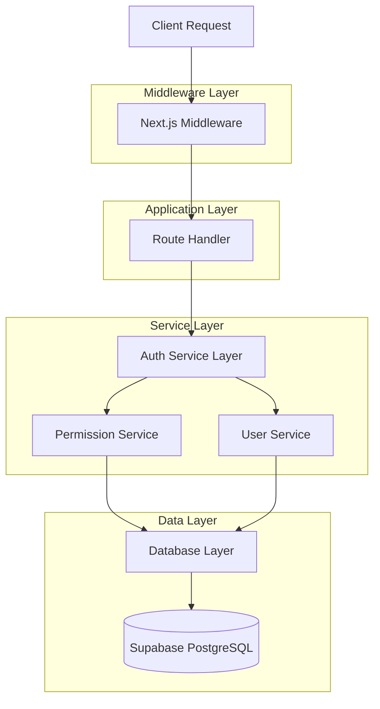
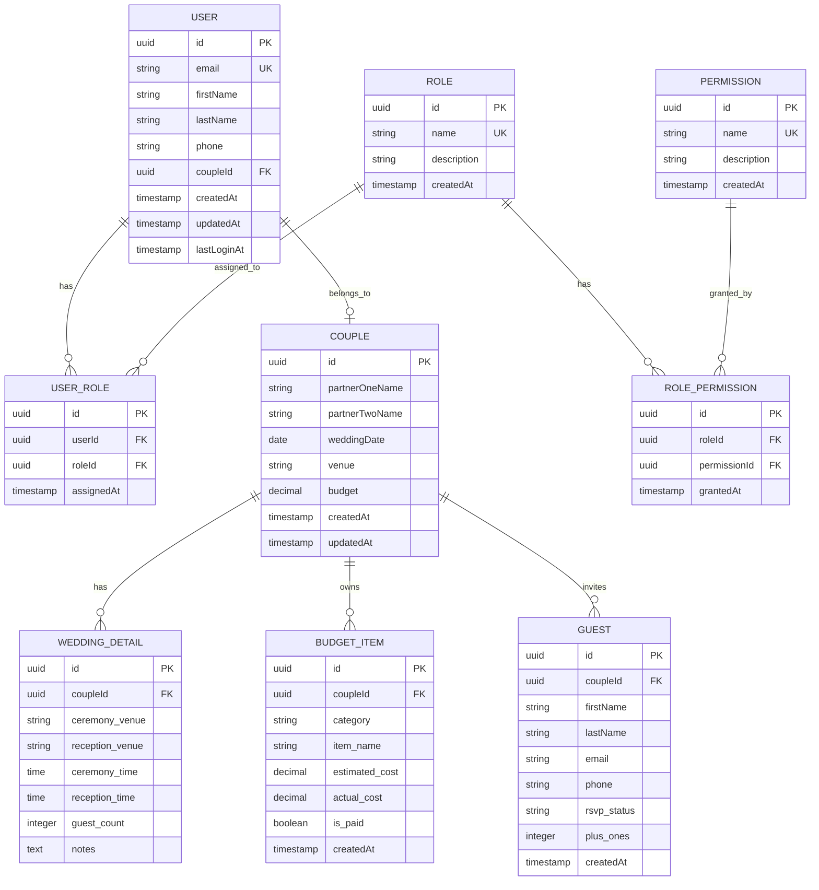
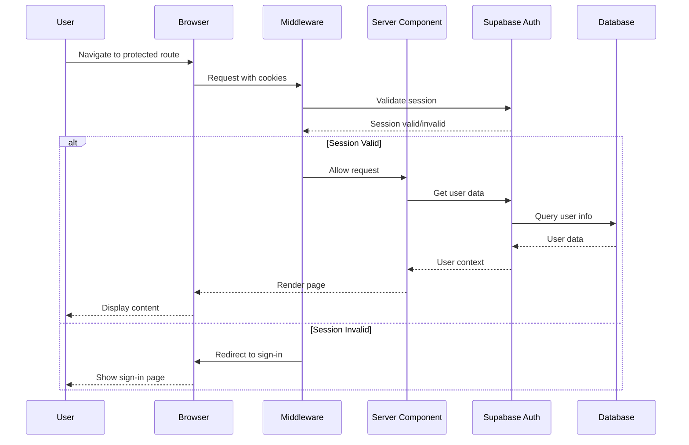
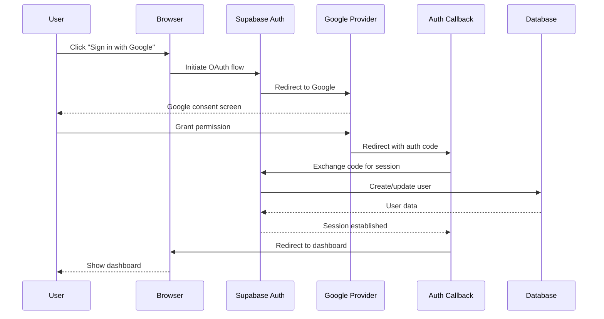
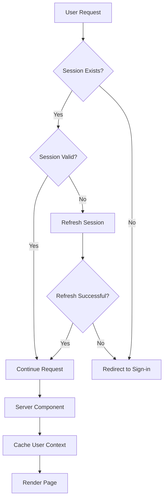

# Supabase Auth Technical Architecture

## 1. Architecture Design



## 2. Technology Description

- **Frontend**: Next.js 14/15 App Router + React 18 + TypeScript
- **Authentication**: Supabase Auth with @supabase/auth-helpers-nextjs@^0.8.7
- **Database**: Supabase PostgreSQL with Prisma ORM
- **Styling**: Tailwind CSS + Radix UI components
- **State Management**: Server-side first with React cache
- **Session Management**: HTTP-only cookies via Supabase Auth Helpers

## 3. Route Definitions

| Route | Purpose | Protection Level |
|-------|---------|------------------|
| / | Landing page | Public |
| /sign-in | Authentication page | Public (redirects if authenticated) |
| /sign-up | Registration page | Public (redirects if authenticated) |
| /auth/callback | OAuth callback handler | Public |
| /dashboard | Main dashboard | Protected (requires authentication) |
| /onboarding | User onboarding flow | Protected (requires authentication) |
| /api/auth/callback | Server-side auth callback | Public |
| /api/* | API endpoints | Protected (requires authentication) |

## 4. API Definitions

### 4.1 Core Authentication APIs

**OAuth Callback Handler**
```
GET /api/auth/callback
```

Query Parameters:
| Param Name | Param Type | isRequired | Description |
|------------|------------|------------|-------------|
| code | string | true | OAuth authorization code |
| redirectTo | string | false | Post-auth redirect URL |

Response:
| Param Name | Param Type | Description |
|------------|------------|-------------|
| redirect | string | Redirect URL after successful auth |

Example Response:
```json
{
  "redirect": "/dashboard"
}
```

**Session Validation**
```
GET /api/auth/session
```

Response:
| Param Name | Param Type | Description |
|------------|------------|-------------|
| user | object | Current user data |
| session | object | Session information |
| authenticated | boolean | Authentication status |

Example Response:
```json
{
  "user": {
    "id": "uuid",
    "email": "user@example.com",
    "firstName": "John",
    "lastName": "Doe"
  },
  "session": {
    "access_token": "jwt_token",
    "expires_at": 1234567890
  },
  "authenticated": true
}
```

**Sign Out**
```
POST /api/auth/signout
```

Response:
| Param Name | Param Type | Description |
|------------|------------|-------------|
| success | boolean | Sign out status |

Example Response:
```json
{
  "success": true
}
```

### 4.2 User Management APIs

**Get Current User**
```
GET /api/user/me
```

Response:
| Param Name | Param Type | Description |
|------------|------------|-------------|
| user | object | Complete user profile |
| couple | object | Associated couple data |
| permissions | array | User permissions |
| roles | array | User roles |

Example Response:
```json
{
  "user": {
    "id": "uuid",
    "email": "user@example.com",
    "firstName": "John",
    "lastName": "Doe",
    "coupleId": "couple_uuid"
  },
  "couple": {
    "id": "couple_uuid",
    "weddingDate": "2024-06-15",
    "venue": "Beautiful Garden"
  },
  "permissions": ["read:budget", "write:budget"],
  "roles": ["groom"]
}
```

**Update User Profile**
```
PUT /api/user/profile
```

Request:
| Param Name | Param Type | isRequired | Description |
|------------|------------|------------|-------------|
| firstName | string | false | User's first name |
| lastName | string | false | User's last name |
| phone | string | false | User's phone number |

Response:
| Param Name | Param Type | Description |
|------------|------------|-------------|
| user | object | Updated user data |
| success | boolean | Update status |

Example Request:
```json
{
  "firstName": "John",
  "lastName": "Smith",
  "phone": "+1234567890"
}
```

Example Response:
```json
{
  "user": {
    "id": "uuid",
    "email": "user@example.com",
    "firstName": "John",
    "lastName": "Smith",
    "phone": "+1234567890"
  },
  "success": true
}
```

## 5. Server Architecture Diagram



## 6. Data Model

### 6.1 Data Model Definition



### 6.2 Data Definition Language

**User Table (users)**
```sql
-- Create users table
CREATE TABLE users (
    id UUID PRIMARY KEY DEFAULT gen_random_uuid(),
    email VARCHAR(255) UNIQUE NOT NULL,
    first_name VARCHAR(100),
    last_name VARCHAR(100),
    phone VARCHAR(20),
    couple_id UUID REFERENCES couples(id),
    created_at TIMESTAMP WITH TIME ZONE DEFAULT NOW(),
    updated_at TIMESTAMP WITH TIME ZONE DEFAULT NOW(),
    last_login_at TIMESTAMP WITH TIME ZONE
);

-- Create indexes
CREATE INDEX idx_users_email ON users(email);
CREATE INDEX idx_users_couple_id ON users(couple_id);
CREATE INDEX idx_users_last_login ON users(last_login_at DESC);

-- Enable RLS
ALTER TABLE users ENABLE ROW LEVEL SECURITY;

-- RLS Policies
CREATE POLICY "Users can view own profile" ON users
    FOR SELECT USING (auth.uid()::text = id::text OR 
                     EXISTS (SELECT 1 FROM couples WHERE id = users.couple_id AND 
                            (partner_one_user_id = auth.uid() OR partner_two_user_id = auth.uid())));

CREATE POLICY "Users can update own profile" ON users
    FOR UPDATE USING (auth.uid()::text = id::text);
```

**Couples Table (couples)**
```sql
-- Create couples table
CREATE TABLE couples (
    id UUID PRIMARY KEY DEFAULT gen_random_uuid(),
    partner_one_name VARCHAR(100) NOT NULL,
    partner_two_name VARCHAR(100) NOT NULL,
    wedding_date DATE,
    venue VARCHAR(255),
    budget DECIMAL(10,2) DEFAULT 0,
    partner_one_user_id UUID REFERENCES users(id),
    partner_two_user_id UUID REFERENCES users(id),
    created_at TIMESTAMP WITH TIME ZONE DEFAULT NOW(),
    updated_at TIMESTAMP WITH TIME ZONE DEFAULT NOW()
);

-- Create indexes
CREATE INDEX idx_couples_wedding_date ON couples(wedding_date);
CREATE INDEX idx_couples_partner_one ON couples(partner_one_user_id);
CREATE INDEX idx_couples_partner_two ON couples(partner_two_user_id);

-- Enable RLS
ALTER TABLE couples ENABLE ROW LEVEL SECURITY;

-- RLS Policies
CREATE POLICY "Couple members can view couple data" ON couples
    FOR SELECT USING (partner_one_user_id = auth.uid() OR partner_two_user_id = auth.uid());

CREATE POLICY "Couple members can update couple data" ON couples
    FOR UPDATE USING (partner_one_user_id = auth.uid() OR partner_two_user_id = auth.uid());
```

**Roles Table (roles)**
```sql
-- Create roles table
CREATE TABLE roles (
    id UUID PRIMARY KEY DEFAULT gen_random_uuid(),
    name VARCHAR(50) UNIQUE NOT NULL,
    description TEXT,
    created_at TIMESTAMP WITH TIME ZONE DEFAULT NOW()
);

-- Insert default roles
INSERT INTO roles (name, description) VALUES
    ('bride', 'Bride role with full planning permissions'),
    ('groom', 'Groom role with full planning permissions'),
    ('planner', 'Wedding planner with administrative permissions'),
    ('guest', 'Guest with limited view permissions');
```

**Permissions Table (permissions)**
```sql
-- Create permissions table
CREATE TABLE permissions (
    id UUID PRIMARY KEY DEFAULT gen_random_uuid(),
    name VARCHAR(100) UNIQUE NOT NULL,
    description TEXT,
    created_at TIMESTAMP WITH TIME ZONE DEFAULT NOW()
);

-- Insert default permissions
INSERT INTO permissions (name, description) VALUES
    ('read:budget', 'View budget information'),
    ('write:budget', 'Create and edit budget items'),
    ('read:guests', 'View guest list'),
    ('write:guests', 'Manage guest list'),
    ('read:vendors', 'View vendor information'),
    ('write:vendors', 'Manage vendor relationships'),
    ('read:timeline', 'View wedding timeline'),
    ('write:timeline', 'Manage wedding timeline'),
    ('admin', 'Full administrative access');
```

**User Roles Junction Table (user_roles)**
```sql
-- Create user_roles junction table
CREATE TABLE user_roles (
    id UUID PRIMARY KEY DEFAULT gen_random_uuid(),
    user_id UUID NOT NULL REFERENCES users(id) ON DELETE CASCADE,
    role_id UUID NOT NULL REFERENCES roles(id) ON DELETE CASCADE,
    assigned_at TIMESTAMP WITH TIME ZONE DEFAULT NOW(),
    UNIQUE(user_id, role_id)
);

-- Create indexes
CREATE INDEX idx_user_roles_user_id ON user_roles(user_id);
CREATE INDEX idx_user_roles_role_id ON user_roles(role_id);

-- Enable RLS
ALTER TABLE user_roles ENABLE ROW LEVEL SECURITY;

-- RLS Policies
CREATE POLICY "Users can view own roles" ON user_roles
    FOR SELECT USING (user_id = auth.uid());
```

**Role Permissions Junction Table (role_permissions)**
```sql
-- Create role_permissions junction table
CREATE TABLE role_permissions (
    id UUID PRIMARY KEY DEFAULT gen_random_uuid(),
    role_id UUID NOT NULL REFERENCES roles(id) ON DELETE CASCADE,
    permission_id UUID NOT NULL REFERENCES permissions(id) ON DELETE CASCADE,
    granted_at TIMESTAMP WITH TIME ZONE DEFAULT NOW(),
    UNIQUE(role_id, permission_id)
);

-- Create indexes
CREATE INDEX idx_role_permissions_role_id ON role_permissions(role_id);
CREATE INDEX idx_role_permissions_permission_id ON role_permissions(permission_id);

-- Insert default role permissions
INSERT INTO role_permissions (role_id, permission_id)
SELECT r.id, p.id
FROM roles r, permissions p
WHERE (r.name IN ('bride', 'groom') AND p.name != 'admin')
   OR (r.name = 'planner' AND p.name = 'admin')
   OR (r.name = 'guest' AND p.name LIKE 'read:%');
```

**Budget Items Table (budget_items)**
```sql
-- Create budget_items table
CREATE TABLE budget_items (
    id UUID PRIMARY KEY DEFAULT gen_random_uuid(),
    couple_id UUID NOT NULL REFERENCES couples(id) ON DELETE CASCADE,
    category VARCHAR(100) NOT NULL,
    item_name VARCHAR(255) NOT NULL,
    estimated_cost DECIMAL(10,2) DEFAULT 0,
    actual_cost DECIMAL(10,2) DEFAULT 0,
    is_paid BOOLEAN DEFAULT FALSE,
    notes TEXT,
    created_at TIMESTAMP WITH TIME ZONE DEFAULT NOW(),
    updated_at TIMESTAMP WITH TIME ZONE DEFAULT NOW()
);

-- Create indexes
CREATE INDEX idx_budget_items_couple_id ON budget_items(couple_id);
CREATE INDEX idx_budget_items_category ON budget_items(category);
CREATE INDEX idx_budget_items_is_paid ON budget_items(is_paid);

-- Enable RLS
ALTER TABLE budget_items ENABLE ROW LEVEL SECURITY;

-- RLS Policies
CREATE POLICY "Couple members can manage budget items" ON budget_items
    FOR ALL USING (
        EXISTS (
            SELECT 1 FROM couples c 
            WHERE c.id = budget_items.couple_id 
            AND (c.partner_one_user_id = auth.uid() OR c.partner_two_user_id = auth.uid())
        )
    );
```

**Guests Table (guests)**
```sql
-- Create guests table
CREATE TABLE guests (
    id UUID PRIMARY KEY DEFAULT gen_random_uuid(),
    couple_id UUID NOT NULL REFERENCES couples(id) ON DELETE CASCADE,
    first_name VARCHAR(100) NOT NULL,
    last_name VARCHAR(100) NOT NULL,
    email VARCHAR(255),
    phone VARCHAR(20),
    rsvp_status VARCHAR(20) DEFAULT 'pending' CHECK (rsvp_status IN ('pending', 'attending', 'declined')),
    plus_ones INTEGER DEFAULT 0,
    dietary_restrictions TEXT,
    notes TEXT,
    created_at TIMESTAMP WITH TIME ZONE DEFAULT NOW(),
    updated_at TIMESTAMP WITH TIME ZONE DEFAULT NOW()
);

-- Create indexes
CREATE INDEX idx_guests_couple_id ON guests(couple_id);
CREATE INDEX idx_guests_rsvp_status ON guests(rsvp_status);
CREATE INDEX idx_guests_email ON guests(email);

-- Enable RLS
ALTER TABLE guests ENABLE ROW LEVEL SECURITY;

-- RLS Policies
CREATE POLICY "Couple members can manage guests" ON guests
    FOR ALL USING (
        EXISTS (
            SELECT 1 FROM couples c 
            WHERE c.id = guests.couple_id 
            AND (c.partner_one_user_id = auth.uid() OR c.partner_two_user_id = auth.uid())
        )
    );
```

## 7. Authentication Flow Architecture

### 7.1 Server-Side Authentication Flow



### 7.2 OAuth Authentication Flow



### 7.3 Session Management Architecture



This technical architecture provides a comprehensive foundation for implementing secure, scalable, and maintainable authentication using Supabase Auth in a Next.js App Router application.