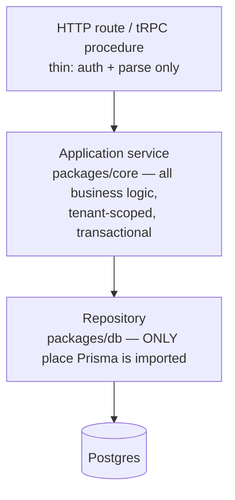
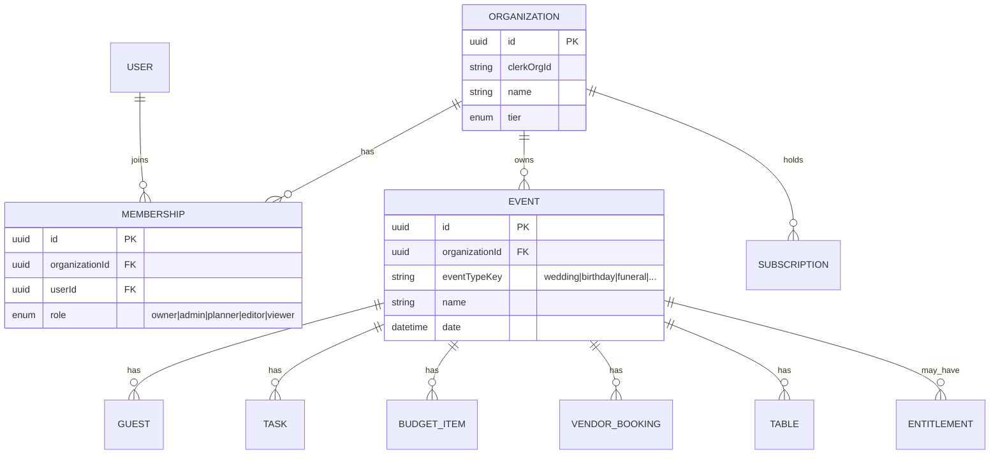

# Planr Foundation — Design Spec

> This document is the **single source of truth** for Planr's architecture. It supersedes all prior
> docs (the old `CLAUDE.md`, `IMPROVEMENT_PLAN.md`, `MIGRATION_INSTRUCTIONS.md`, and the `docs/task-*`
> summaries), which described a half-migrated codebase and were deleted on 2026-06-04.

## 1. Why this exists

The first build of Planr stalled — not because of a wrong framework, but because it grew through
repeated automated setup passes that each scaffolded an *aspirational* architecture and abandoned it
half-done. An audit found three parallel app trees, two database schemas, two live datastores, an
exploitable auth hole, broken (Postgres-only) migrations on a SQLite datasource, and a flagship doc
describing a database the code never used.

This spec resets the foundation deliberately, to a high bar: **robust from the first commit, scales
fast, and the leap to enterprise is a configuration change — not a rewrite.** We build the *general*
shape from day one and ship the *wedding configuration* first.

## 2. Product vision & trajectory

Planr launches as a **wedding planner** (guest management, seating arrangements, vendors + vendor
matching, budget, tasks/timeline, RSVP, messaging). It then becomes a **general event platform**
covering birthdays, funerals, bridal showers, corporate events, galas, and more.

Two consequences drive every decision below:

1. **The domain is event-generic from commit #1.** "Wedding" is the first *event type* — a
   configuration, never a hardcoded code path. There is no `bride`/`groom`/`Side` in the schema.
2. **The customer expands from couples → planning agencies → enterprise.** The tenant is an
   **Organization**, never a user. A solo couple is an Organization of one. An agency managing many
   weddings and galas is an Organization with a team and many events.

## 3. Foundational decisions (locked)

| # | Decision | Choice | One-line rationale |
|---|----------|--------|--------------------|
| 1 | Codebase strategy | **Fresh foundation, port the gems** | Salvage-in-place inherits invisible contamination; "clean" would be asymptotic. |
| 2 | Tenancy | **Organization → Membership(role) → Event** | Enterprise = more members/roles/SSO, not a re-scope of every table. One-way door, built right once. |
| 3 | Domain | **Event-centric, type-polymorphic** | Adding an event type = registering a profile, not re-architecting. |
| 4 | Runtime + DB | **Vercel + Neon Postgres** | Standard Postgres = portable to RDS/Aurora/container by swapping `DATABASE_URL`. |
| 5 | Auth | **Clerk; our tables are authz source of truth** | Secure sessions/MFA/SSO as a config flip; Clerk owns identity, we own authorization. |
| 6 | Monetization | **Entitlement engine; à-la-carte launch packaging** | Pricing/packaging change via a plan registry, zero feature-code change. |
| 7 | Interface | **Event-type registry × entitlement engine** | A module renders ⟺ relevant-to-type AND entitled — both enforced server-side. |

### 3.1 Why not salvage in place
The old repo carries ~390 cruft files (two dead app trees), 164 type errors hidden behind a
`tsconfig` exclude list, two datastores, and an auth impersonation hole. We instead stand up a clean
monorepo with CI gates **green from the first commit** and port the genuinely good assets — the
17-entity domain design, the three clean features (guests/tasks/seating), and the Playwright specs —
deliberately, each with tests.

## 4. Architecture overview

### 4.1 Repository shape (monorepo, Turborepo + pnpm)

```
planr/
  apps/
    web/                 # Next.js 15 (UI + API surface) — the only app for now
  packages/
    db/                  # Prisma schema + migrations + seed  ← SINGLE source of truth for data
    core/                # domain: application services (use-cases), Zod DTOs, policies/RBAC,
                         #         event-type registry, capability registry, entitlement engine
    auth/                # Clerk integration + session→Membership resolution, webhook handlers
    billing/            # Stripe integration + plan registry + entitlement sync
    config/              # shared tsconfig, eslint, zod-validated env schema
    ui/                  # shared components (ported selectively from the old tree)
  turbo.json
```

A worker app, an admin app, or a mobile client slots in later without restructuring.

### 4.2 Layering (enforced, not documented-and-ignored)



An ESLint `no-restricted-imports` rule fails CI if `@prisma/client` is imported anywhere outside
`packages/db`. "No direct Prisma in routes" becomes structurally impossible, not a guideline.

### 4.3 API strategy

- **tRPC** for the first-party web app — end-to-end type safety, no codegen.
- **Versioned REST (`/api/v1`, OpenAPI-documented)** for surfaces that must be universal: public
  RSVP, the vendor portal, and webhooks (Clerk, Stripe, email), plus future enterprise integrations.
- Both call the **same application services** — exactly one implementation of each use-case, never a
  duplicate handler.

## 5. Domain model

### 5.1 Tenancy & event spine



- **`organizationId` on every domain row.** Composite indexes lead with it: `(organizationId, ...)`.
- Tenant scoping is enforced in the repository layer. Schema is designed so Postgres **Row-Level
  Security** can be layered on later as defense-in-depth without remodeling.
- The old `Side` (bride/groom) enum is **dropped**. Guest groupings and participant roles are
  configurable per event type (see §6).

### 5.2 Data principles
- Money as Postgres `numeric` / Prisma `Decimal` — **never float**.
- Native enums and native arrays (no comma-joined-string hacks).
- One clean migration baseline via Prisma Migrate; **no `dev.db` committed to git**.
- Seed scripts for local + preview environments.

## 6. Event-type polymorphism

"Wedding" is the first entry in an **Event-Type registry** — a declarative profile, never an
`if (type === 'wedding')` branch. Each event type declares:

- **enabled modules** (a funeral skips gift registry; a birthday may skip formal seating),
- **default templates** — starter task lists, timelines, budget categories, relevant vendor categories,
- **terminology/field overrides** — "wedding party" vs "pallbearers" vs "honorees" without schema change,
- **guest-grouping schemes** — replacing the hardcoded bride/groom `Side`.

Features are **type-aware capabilities** attached to an Event that read the event-type config. Adding
"corporate gala" = registering a profile (+ at most one new module). No migration, no re-architecture.

Examples:
- **Shared (all types):** Guest management, Venue management, Vendors (photographer, sound, caterer…),
  Budget, Tasks/Timeline, RSVP, Messaging.
- **Wedding:** Gift Registry, wedding-party roles.
- **Corporate:** Agenda / run-of-show (speakers, sessions, tea breaks), AV/production vendors.
- **Funeral:** Order of service, pallbearer roles; no registry, no DJ.

Vendor **matching** is its own capability from the start: a scoring service over vendor attributes ×
event requirements × preferences, decoupled so it can grow (ML-ranked later) without touching vendor
CRUD. It is inherently cross-type — a caterer matches weddings *and* galas.

## 7. Interface determination & monetization

### 7.1 The two-registry rule

```
A module renders  ⟺  relevant-to-event-type  AND  entitled
                         (Event-Type registry)   (Entitlement engine)
```

Both gates are enforced **server-side** in the application-service layer and merely *reflected* in the
UI. The client is never trusted. A module is described as
`{ key, appliesToEventTypes, tier: core | advanced, terminology }`.

### 7.2 Entitlement engine (the durable part)

Every capability checks an **entitlement**, never a price or plan name. Entitlements are granted by
purchases. Packaging — à la carte, bundles, tiers, trials, coupons — is edited in a **plan registry**
with zero feature-code change.

- Billing is scoped at the **Organization** (consistent with tenancy).
- Entitlements resolve from **either** an org-level plan (All-Access / agency) **or** an event-level
  purchase (e.g., the $49 birthday). The check is always: *does this org/event hold entitlement X?*

### 7.3 Launch packaging (the configurable part)

| Plan | Scope | Unlocks |
|------|-------|---------|
| **Free** | per event | Core capabilities (guest list, basic tasks/budget), capped (e.g. guest limit). Conversion funnel. |
| **Per-event-type** (e.g. Birthday $49/yr, Wedding $99/yr) | per event | Full capability set for that event type for a year. |
| **Pro upgrade** | per event | Advanced capabilities: vendor matching, seating optimizer, unlimited guests, exports. |
| **All-Access / Planner** | per org (per-seat later) | Every event type. The agency/enterprise on-ramp. |

Prices above are illustrative defaults; they live in the plan registry and are a business decision.

### 7.4 Payments
**Stripe** for subscriptions, proration on upgrades, trials, invoicing + tax (enterprise-ready).
Stripe is the **payment** source of truth; our `Subscription`/`Entitlement` tables are the **access**
source of truth, synced via webhooks — a Stripe outage never locks users out, and lock-in stays shallow.

## 8. Auth & authorization

- **Clerk** owns identity: sessions, MFA, and enterprise SSO/SCIM as a config flip. Clerk
  **Organizations** map 1:1 onto our tenancy.
- **Our `Organization`/`Membership` tables are the authorization source of truth**, synced from Clerk
  via webhooks. If we ever leave Clerk, the domain authz model is untouched.
- A central **policy module** maps roles → permissions (`owner|admin|planner|editor|viewer`), checked
  in application services. No per-route copy-paste; no `x-user-id` trust; no hand-rolled JWT.

## 9. Cross-cutting (robustness)

- **Env:** zod-validated at boot — missing DB/Clerk/Stripe config fails fast with a clear message,
  never silently at runtime. Committed `.env.example`.
- **Errors:** one typed error model; services return structured results. No catch ever masks a DB
  failure as `success: true` (a real bug in the old code).
- **Observability:** pino structured logs + request IDs; Sentry error tracking (porting the better
  parts of the old logging scaffolding).
- **Testing:** Vitest (unit/integration on services + repos, coverage threshold on `core`) +
  Playwright (E2E). All gated in CI: **typecheck · lint · unit · e2e**, green on every PR.

## 10. Enterprise migration story (the payoff)

Everything above is chosen so the enterprise leap is configuration, not reconstruction:

- **Tenancy:** already org-scoped → add members, roles, per-org billing, SSO. No table re-scoping.
- **Auth:** Clerk SSO/SCIM is a config flip.
- **DB:** standard Postgres → point `DATABASE_URL` at RDS/Aurora or a container; add Row-Level Security.
- **Domain:** new event types via registry entries.
- **Packaging:** new plans/seat-based pricing via the plan registry.
- **API:** versioned REST + OpenAPI already present for third-party/enterprise integrations.

## 11. Scope & sequencing

This spec covers the **Foundation only** — it is one coherent, reviewable unit:

> Monorepo + CI gates · `packages/db` schema (Organization, Membership, Event, event-type registry) ·
> auth (Clerk + Membership sync) · billing/entitlement engine + capability registry · layering +
> lint enforcement · env/error/observability/test harness.

Each feature is then ported as its **own** plan, in dependency order, each shipping with tests:

```
Foundation → guests → tasks/timeline → seating → vendors (+ matching)
           → budget → RSVP → messaging → admin
```

We build the generic engine, ship the **wedding event-type profile** as the first vertical, and prove
the model end-to-end before adding more event types.

### Assets to port (not rewrite)
- The 17-entity domain design (generalized: no bride/groom/Side).
- The three clean features: guests, tasks, seating.
- The Playwright E2E specs.
- The logging/monitoring scaffolding (the better part of the old `lib`).

### To be deleted during implementation
- `wedding-planner-new/` (dead duplicate tree), `src/nextjs-admin-dashboard-main/` (vendored template),
  redundant root component dirs, all `start-*.js` launchers, `temp-data/` + `temp-storage.ts`,
  the committed `dev.db`, and the Postgres-only migration folders.

## 12. Risks & mitigations

| Risk | Mitigation |
|------|------------|
| Port drags on; two systems coexist | Strict feature-by-feature order; each feature merges only when its tests are green. Old tree is read-only reference, never extended. |
| Clerk/Stripe vendor lock-in | Our own Membership/Entitlement tables are the source of truth for authz/access; providers own only identity/payment. |
| Event-type abstraction over-engineered before a 2nd type exists | Registry is a thin declarative config, not a plugin framework. Wedding is the only profile until a real 2nd type is funded. |
| Entitlement checks scattered/inconsistent | Single entitlement-resolution service; capability gating lives in one place, enforced server-side. |
| SQLite-era data | Re-seed from clean Postgres migrations; no attempt to carry the old `dev.db`. |

## 13. Success criteria

- CI (typecheck · lint · unit · e2e) is **green from the first commit** and stays green per PR.
- No `@prisma/client` import outside `packages/db` (lint-enforced).
- A wedding can be created, guests added, tasks/seating managed end-to-end, behind real Clerk auth and
  a working entitlement gate.
- Standing up a second event type requires **no schema migration** — only a registry entry.
- A new developer can clone, `pnpm install`, configure `.env` from `.env.example`, and run the app +
  full test suite with documented commands.
