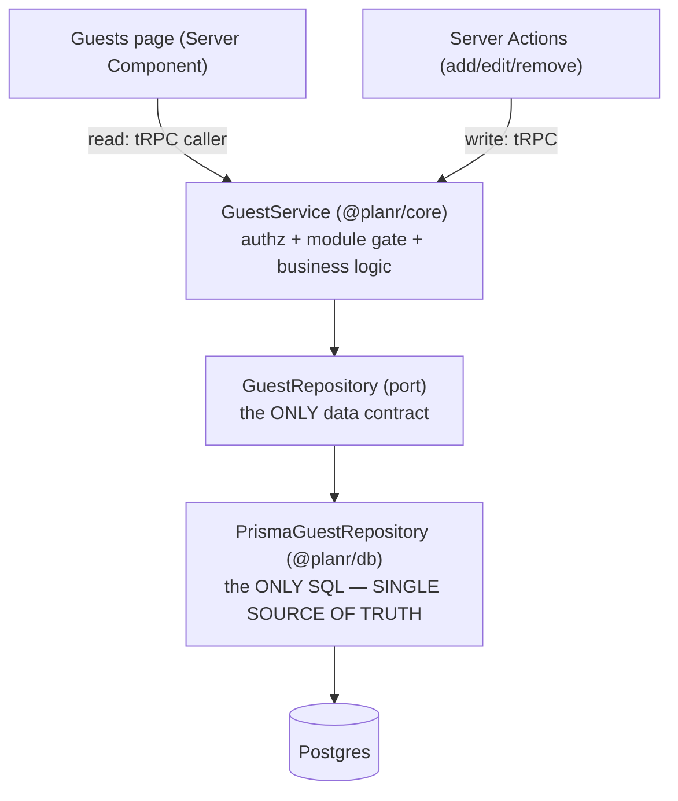

# Planr Guest List — Design Spec

> The first **real feature** on top of the foundation, and the **template** every later feature
> (`tasks`, `budget`, `seating`, `vendors`…) copies. Held to an enterprise standard from the onset:
> sound, scalable, secure, observable, and shaped for change — without gold-plating.

## 1. Goal & context

Let a host manage the guest list for an event — add/edit/remove guests, track RSVP status, and see a
live summary ("84 guests · 51 coming · 12 declined · 21 awaiting"). It is the first genuinely useful,
**free** tool, and it must work for **any** event type (wedding, baby shower, funeral, party…).

- **Free at launch, lockable later.** Planr launches free (see `project-planr-free-launch` memory).
  Guests ships as a normal **entitlement-gated module** ("guests"); the gate is wired in but open. When
  Stripe lands, a single config flip + plan config locks it — **zero feature rewrite**.
- **Single source of truth.** `@planr/db` (Prisma + Postgres) is the only data authority; nothing
  touches the DB except a repository — enforced by the existing lint boundary (no `@prisma/client`
  outside `@planr/db`).

## 2. Decisions (locked)

| # | Decision | Choice |
|---|----------|--------|
| 1 | Per-guest fields | **Standard**: name (required), email, phone, group label, plus-one, RSVP status, notes |
| 2 | RSVP in v1 | **Host sets manually**; a public "guests RSVP themselves" page is a deferred future feature |
| 3 | Access | **Entitlement-gated** ("guests" module); free now via a reversible config flag |
| 4 | Shape | A self-contained vertical slice using the architecture & naming below |

## 3. Architecture & the single source of truth

One vertical slice through fixed layers; the repository is the sole data contract, the Prisma adapter
the sole place SQL runs.



- `@planr/core` stays framework-free (no Prisma, no Next). The service depends on the **port**, not the
  adapter — so it is unit-tested with in-memory fakes and the Prisma adapter is integration-tested
  against real Postgres. This is what makes the slice an independent, diagnosable block.
- The "guests" **module gate** is resolved in the service via the existing entitlement engine, so the
  lock is present from day one (§6).

## 4. The shared database (site-wide spine vs feature-local)

**Shared by the whole site** — the multi-tenant + event backbone every feature reuses, unchanged:
`User`, `Organization` (workspace), `Membership` (user×org×role), `Event`, `Invitation`,
`Entitlement`/`Subscription` (the dormant access/billing layer = the lock).

**New, feature-local:** `Guest`, hanging off `Event`.

```prisma
enum RsvpStatus { awaiting coming declined maybe }

model Guest {
  id             String     @id @default(uuid())
  organizationId String                                  // denormalised tenant key (defence in depth)
  eventId        String
  name           String
  email          String?
  phone          String?
  groupLabel     String?                                 // free-text "Bride's family", "Work", …
  plusOne        Boolean    @default(false)
  rsvpStatus     RsvpStatus @default(awaiting)
  notes          String?
  createdAt      DateTime   @default(now())
  updatedAt      DateTime   @updatedAt
  event          Event        @relation(fields: [eventId], references: [id], onDelete: Cascade)
  organization   Organization @relation(fields: [organizationId], references: [id], onDelete: Cascade)

  @@index([eventId])
  @@index([organizationId, eventId])
  @@index([eventId, rsvpStatus])   // powers the aggregate summary
}
```

Every future feature table (`Task`, `BudgetItem`, `Table`/`Seat`, `Vendor`) follows this exact shape —
own table, `organizationId` + `eventId`, cascade with the event. The spine never changes shape as
features are added.

## 5. Screenflow

```
 Event toolkit  /…/event/[eventId]
 ┌───────────────────────────────────────┐
 │ Plan this event                       │
 │ ▸ Guests   (open)  ──────────────┐    │  tiles gated by the entitlement engine.
 │ ▸ Budget   (coming soon)         │    │  Built + unlocked → opens. Unbuilt → "Coming soon".
 │ ▸ Seating  (coming soon)         │    │  Locked (post-monetisation) → upgrade prompt.
 └──────────────────────────────────┼────┘
                                    ▼
 Guests  /…/event/[eventId]/guests
 ┌───────────────────────────────────────┐
 │ 84 guests · 51 coming · 12 no · 21 ⧗  │  live summary (aggregate counts)
 │ + Add guest  [name][email][group][+1] │  inline add
 │ Aunt Mary  mary@…  Bride's family  ▾  │  inline edit RSVP / remove
 │ … (paginated — "Load more")           │
 └───────────────────────────────────────┘
```
Entry from the Guests tile. Unauthenticated → `/sign-in`; non-member of the org → blocked. Back returns
to the toolkit.

## 6. Free-launch & lockable-later mechanism

A **single gate** decides module access; "free launch" is one reversible flag, not a property of the
feature.

- `GuestService` resolves the "guests" module through a shared gate: `moduleGate(freeLaunch)` →
  if `freeLaunch` is on, access is **available** regardless of entitlements; otherwise it uses the
  Plan-1 `resolveModuleAccess(held, …)`.
- `freeLaunch` comes from app config (parsed env, default **on** now). **Monetising = set it off and
  configure plans** — the same gate then returns "locked" and the page shows an upgrade prompt instead
  of the list. No change to `Guest`, the repository, the service logic, or the UI components.
- The entitlement engine, plan registry, and billing service (Plans 1 & 5) stay in the codebase,
  dormant and unit-tested.

## 7. Interactions / data flow

- **Read** — the Guests page (Server Component) calls `guests.summary` + `guests.list` via the authed
  tRPC caller → `GuestService` (gate: module available; authz: caller is a member of the org) →
  `GuestRepository.summaryByEvent` / `listByEvent` → Postgres.
- **Write** — add/edit/remove use **Server Actions** → the same tRPC procedures → `GuestService`
  (gate + authz: `content:edit` permission) → repository → DB → `revalidatePath`.
- **Authorization** is layered: module gate, then membership/permission in the service, then the
  repository scopes **every** query by `(organizationId, eventId)` — a guessed `guestId` from another
  tenant returns nothing.

## 8. Enterprise requirements (hard, encoded in the plan)

- **A. Integrity in the database** — `RsvpStatus` is a real enum; required columns `NOT NULL`; FKs
  cascade with the event/org; indexes on tenant + summary query paths.
- **B. Scale from row one** — `guests.list` is **paginated** (keyset cursor on `(createdAt, id)`,
  default limit 50, max 100); the summary is `COUNT … GROUP BY rsvpStatus` (never a drift-prone
  denormalised counter, never "load all").
- **C. Tenant isolation in depth** — service membership/permission check **and** repository
  `(organizationId, eventId)` scoping on every query (no IDOR); schema shaped so Postgres RLS can be
  added later without remodelling.
- **D. One validation contract** — a single Zod schema (`guestInput`) in `@planr/core` is reused by the
  tRPC input and the domain; client and server cannot disagree on validity (email format, name 1–120
  chars, enum values).
- **E. Typed, non-swallowed errors** — `NotFoundError`/`ForbiddenError` map to tRPC `NOT_FOUND` /
  `FORBIDDEN`; a DB failure is never returned as fake success.
- **F. Stable, additive API** — named tRPC procedures with explicit input/output types; evolve by
  adding fields, never breaking — so future clients (mobile, partners) don't shatter.
- **G. Seams, not speculation** — `Guest.id` is stable for the future Seating chart to reference;
  normalised so households / public RSVP / meal options slot in later. None of those are built now.
- **H. Test depth as a merge gate** — unit (every branch incl. authz denials + cross-tenant attempts),
  integration vs real Postgres (constraint enforcement, pagination, cascade delete, summary accuracy),
  and a browser E2E. All green before merge.
- **I. Forward-only migrations** — hand-written/verified SQL, applied and proven against a real DB
  before commit; never destructive on populated tables.

## 9. API contract (tRPC `guests.*`)

| Procedure | Kind | Input | Output |
|---|---|---|---|
| `guests.summary` | query | `{ eventId }` | `{ total, coming, declined, maybe, awaiting }` |
| `guests.list` | query | `{ eventId, cursor?, limit? (≤100) }` | `{ guests: GuestRecord[], nextCursor: string \| null }` |
| `guests.create` | mutation | `{ eventId, guest: guestInput }` | `GuestRecord` |
| `guests.update` | mutation | `{ eventId, guestId, patch: Partial<guestInput> }` | `GuestRecord` |
| `guests.remove` | mutation | `{ eventId, guestId }` | `{ ok: true }` |

`organizationId` is **never** taken from input — it is resolved from the event the caller is authorised
for, preventing tenant spoofing. `GuestRecord = { id, eventId, name, email, phone, groupLabel, plusOne,
rsvpStatus, notes }`.

## 10. Naming scheme (every feature follows this)

| Layer | Convention | Guest example |
|---|---|---|
| DB model / enum | PascalCase singular | `Guest`, `RsvpStatus` |
| Columns | camelCase; tenant keys `organizationId`,`eventId` | `rsvpStatus`, `plusOne`, `groupLabel` |
| Domain record (port) | `<Entity>Record` | `GuestRecord` |
| Repository port / adapter | `<Entity>Repository` / `Prisma<Entity>Repository` | `GuestRepository` / `PrismaGuestRepository` |
| Service | `make<Entity>Service` | `makeGuestService` |
| Validation DTO | `<entity>Input` (Zod) | `guestInput` |
| tRPC router | plural namespace + verbs | `guests.summary/list/create/update/remove` |
| Web route | `/dashboard/org/[orgId]/event/[eventId]/<feature>` | `…/guests` |
| Server action | `<verb><Entity>Action` | `addGuestAction`, `updateGuestAction`, `removeGuestAction` |
| Files | `<entity>.<layer>.ts`; route `page.tsx` | `guest.repository.ts`, `guest.service.ts` |
| Tests | `.test.ts` unit · `.int.test.ts` integration · `.spec.ts` E2E | `guest.service.test.ts` |

## 11. Out of scope (deferred, with seams left)

Public RSVP page (shareable no-auth link), households (one invite for several guests), meal-option
counts, CSV import, seating assignment (a later feature that FKs to `Guest.id`). The schema and API are
shaped so each is additive.

## 12. Success criteria

- A host opens an event's **Guests** tile, adds guests, sets their RSVP, removes one, and sees the
  summary update — for any event type, in the Keepsake design.
- A non-member cannot read or write another workspace's guests (proven by an adversarial test).
- Listing 200+ guests is paginated and the summary is a single aggregate query (no "load all").
- Flipping `freeLaunch` off + configuring a plan locks the Guests module via the existing gate — with no
  change to `Guest`, the repository, the service, or the UI (demonstrated by a unit test of the gate).
- All suites green: unit, integration vs Postgres, and the Playwright E2E.
