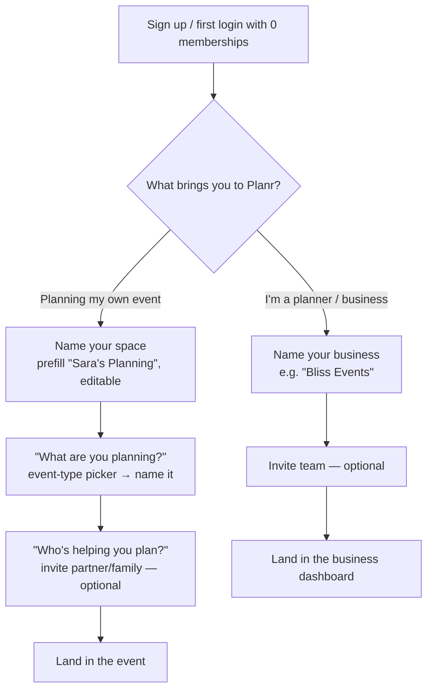
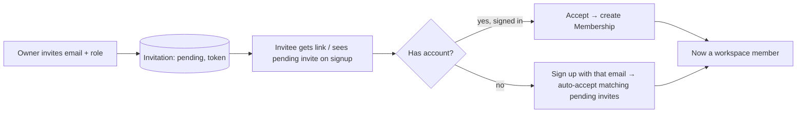

# Planr Workspaces, Onboarding & Collaboration — Design Spec

> Builds on the foundation spec (`2026-06-04-planr-foundation-design.md`). The foundation is sound;
> this spec adds the **human layer** on top of it — making Planr usable by ordinary people, not just
> "organizations".

## 1. Problem

Planr is an event planner for everyone's life events — weddings, baby showers, hen nights, burials,
house parties, birthdays. But the current app forces every new user to "create an organization" before
they can do anything. That word is business-speak: a bride, a mum planning a shower, or a family
arranging a burial should never meet it. The app reads as B2B-only when it is meant for **both**
ordinary individuals **and** professional event/wedding planners.

**Crucially, this is not a re-architecture.** The foundation's tenant is the `Organization`, but that
is internal plumbing. An "individual" and a "business" are *both* an Organization with members and
events — they differ only in framing. So the fix is a thin onboarding + terminology layer plus one
schema field, leaving the entitlement engine, event-type registry, and tested core untouched.

## 2. Decisions (agreed)

| # | Decision | Choice |
|---|----------|--------|
| 1 | Audience | **Both at launch**, via an explicit onboarding fork (individual vs business). |
| 2 | Workspace visibility | **Light workspace shown** — a friendly container ("My Planning" / the business name); the word "organization" never appears. |
| 3 | Collaboration | **First-class** — invite people to plan with you, by email. |
| 4 | Collaboration scope | **Workspace-level** for now (an invitee sees all events in that workspace). Per-event sharing is deferred to the business tier. |
| 5 | Sequencing | **Plan A** (workspaces + onboarding) → **Plan B** (collaboration); visual design is a parallel track. |

## 3. Data model changes (minimal)

- **`Organization.type`** — new enum `OrgType { individual, business }`. Set during onboarding.
- **"Onboarded" = "has ≥ 1 membership."** A freshly-signed-up user with zero memberships is routed to
  the onboarding wizard. No new flag needed — membership count is the signal.
- **`Invitation`** (Plan B) — `{ id, organizationId, email, role, token, status: pending|accepted|revoked,
  invitedByUserId, createdAt }`. Lets us invite an email that has no account yet; becomes a `Membership`
  when the person signs up/accepts.
- Unchanged: `Membership` + its `Role` (owner/admin/planner/editor/viewer), `Event`, the entitlement
  engine. `Organization.name` already exists (workspace/business display name).

## 4. Onboarding wizard (Plan A) — replaces the "create an organization" form

- Both paths create an `Organization` (with `type` set) + an owner `Membership` for the creator.
- Individual path additionally creates the **first Event inline** (so the bride finishes onboarding
  *inside her wedding*, not staring at an empty dashboard).
- The invite steps are **optional** (skippable) in Plan A's UI; they become functional in Plan B.

## 5. The app, reframed by workspace type (terminology layer)

The same components read `org.type` to choose copy. No new screens per audience — one set of screens,
two vocabularies.

| Concept | `individual` | `business` |
|---|---|---|
| The container | "My Planning" / "your events" | the business / agency name |
| Other members | "people helping you plan" | "team" |
| Invite CTA | "Invite someone to help" | "Invite a team member" |
| Home | **My events** (list) + "Plan something new" | events across clients |

- Home for an individual lists their events directly (no "organization" step).
- If a user belongs to **more than one** workspace (e.g. their own personal space *and* an agency they
  work at), a small **workspace switcher** appears. Single-workspace users never see it.
- Routing: after auth, a user with **0 memberships** → onboarding wizard; otherwise → their home
  (defaulting to their sole/most-recent workspace).

## 6. Collaboration (Plan B)

Invite by **email** to a workspace with a role (default **editor** — can edit content; the creator is
**owner**). Because the invitee may not have an account:

- Wired into both the onboarding "who's helping you plan?" step and an in-app "Invite" action +
  member list (view/remove members, change role — owner/admin only).
- Authorization reuses the existing `makeAuthorizationService` (role → permission). Inviting/removing
  members requires `member:invite` / `member:remove` (owner/admin).

## 7. Architecture notes (how it fits the foundation)

- **No change to the hexagonal layering.** New use-cases are core services (`OnboardingService`,
  `InvitationService`) over the existing repository ports; new Prisma adapters where needed.
- **tRPC** gains procedures: `onboarding.completeIndividual`/`completeBusiness`, `workspaces.list`,
  `invitations.create/accept/list`, `members.list/remove/setRole`. All behind `authedProcedure` with
  authorization checks; none let a user escalate their own access.
- **The onboarding wizard is UI over those procedures**, following the Plan 3/4 pattern (Server
  Components read via the authed caller; Server Actions mutate through it).
- **Entitlement engine untouched** — an individual buying a per-event plan and a business buying
  all-access both flow through the existing `applyPlanPurchase`.

## 8. Decomposition & sequencing

| Plan | Scope | Ships |
|---|---|---|
| **A — Workspaces & Onboarding** | `Organization.type` migration; onboarding fork (both paths) incl. inline first-event for individuals; workspace-framed home + terminology; post-auth routing (0 memberships → onboarding); workspace switcher | A real bride can sign up and land inside her wedding. |
| **B — Collaboration** | `Invitation` model + accept flow; invite-by-email; member list + role management; wire into onboarding's "who's helping?" step | Events can be planned together. |
| **Visual (parallel)** | `frontend-design` pass over the above | It looks like a product. Independent; sequence anytime. |

Each plan is independently shippable and testable (unit + integration against Supabase, Playwright E2E
for the flows), following the established pattern.

## 9. Out of scope (deliberately deferred)

- **Per-event sharing** (a planner sees only one client's event) — business-tier refinement; the data
  model can grow an `EventMember` later without disturbing workspace membership.
- **Business client management** (organising events by client, client-facing portals).
- **Billing-by-type nuance** (individuals → per-event plans; businesses → seats/all-access) — the
  entitlement engine already supports both; UX packaging is a later pass.
- **Visual design** — tracked separately via `frontend-design`.

## 10. Success criteria

- A new individual: sign up → choose "my own event" → name space → pick "Baby shower" → name it →
  (optionally invite) → lands **inside the event**, never seeing the word "organization".
- A new business: sign up → choose "planner/business" → name business → lands in a dashboard to create
  events.
- A returning user with workspaces lands on their home (their events), not an onboarding screen.
- (Plan B) An invited partner with no prior account can sign up and immediately see the shared event.
- All flows covered by integration tests + a Playwright E2E; the foundation's test suites stay green.
