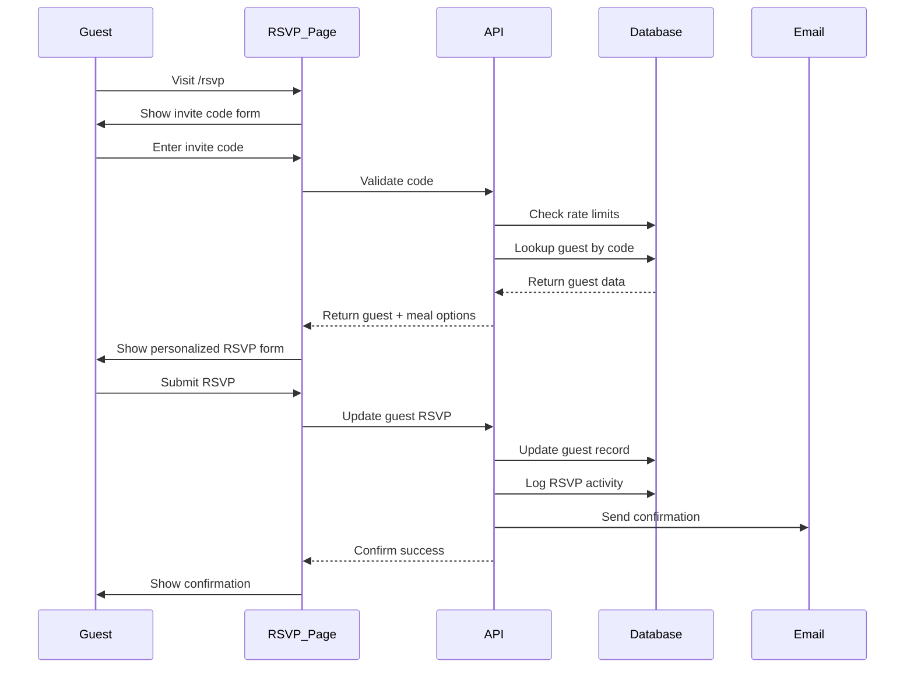
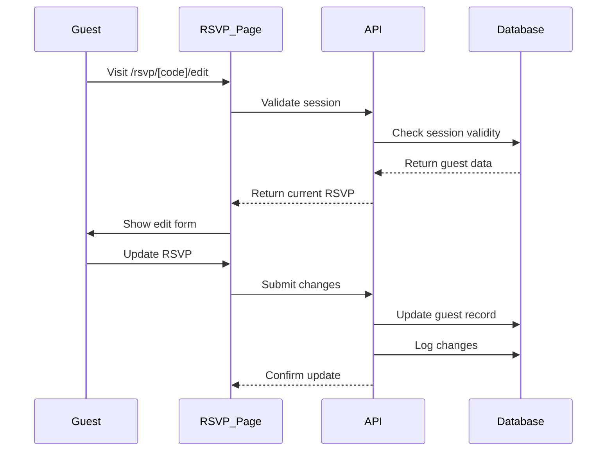

# RSVP System Architecture

## Overview

The RSVP system enables wedding guests to respond to invitations without requiring authentication. Guests use unique invite codes to access their personalized RSVP pages where they can confirm attendance, update their information, manage plus-ones, and select meal preferences.

## System Architecture

### 1. Database Schema

#### Existing Tables (Enhanced)
```sql
-- wedding_guests (existing table - already has invite_code)
CREATE TABLE wedding_guests (
  id UUID PRIMARY KEY,
  couple_id UUID REFERENCES wedding_couples(id),
  invite_code VARCHAR(6) UNIQUE NOT NULL, -- Already exists
  first_name VARCHAR(100) NOT NULL,
  last_name VARCHAR(100) NOT NULL,
  email VARCHAR(255),
  phone VARCHAR(20),
  -- ... existing fields ...
  rsvp_status VARCHAR(20) DEFAULT 'pending',
  rsvp_date TIMESTAMP,
  rsvp_notes TEXT,
  meal_choice UUID REFERENCES meal_options(id),
  dietary_restrictions TEXT,
  plus_one_allowed BOOLEAN DEFAULT false,
  plus_one_name VARCHAR(100),
  plus_one_attending BOOLEAN DEFAULT false,
  plus_one_meal_choice UUID REFERENCES meal_options(id),
  plus_one_dietary_restrictions TEXT,
  -- New fields for RSVP system
  rsvp_reminder_sent TIMESTAMP,
  rsvp_ip_address INET,
  rsvp_user_agent TEXT,
  last_viewed_at TIMESTAMP,
  updated_via_rsvp BOOLEAN DEFAULT false
);

-- New table for meal options
CREATE TABLE meal_options (
  id UUID PRIMARY KEY DEFAULT gen_random_uuid(),
  couple_id UUID REFERENCES wedding_couples(id),
  name VARCHAR(100) NOT NULL,
  description TEXT,
  category VARCHAR(50), -- 'adult', 'child', 'vegetarian', etc.
  is_active BOOLEAN DEFAULT true,
  sort_order INTEGER DEFAULT 0,
  created_at TIMESTAMP DEFAULT NOW()
);

-- New table for RSVP sessions (for tracking and rate limiting)
CREATE TABLE rsvp_sessions (
  id UUID PRIMARY KEY DEFAULT gen_random_uuid(),
  invite_code VARCHAR(6) NOT NULL,
  guest_id UUID REFERENCES wedding_guests(id),
  ip_address INET,
  user_agent TEXT,
  created_at TIMESTAMP DEFAULT NOW(),
  last_activity TIMESTAMP DEFAULT NOW(),
  attempts INTEGER DEFAULT 0,
  blocked_until TIMESTAMP,
  successful BOOLEAN DEFAULT false
);

-- New table for RSVP activity logs
CREATE TABLE rsvp_activity_logs (
  id UUID PRIMARY KEY DEFAULT gen_random_uuid(),
  guest_id UUID REFERENCES wedding_guests(id),
  action_type VARCHAR(50) NOT NULL, -- 'viewed', 'updated', 'confirmed', etc.
  old_values JSONB,
  new_values JSONB,
  ip_address INET,
  user_agent TEXT,
  created_at TIMESTAMP DEFAULT NOW()
);
```

### 2. URL Structure

```
/rsvp                          - RSVP landing page (enter invite code)
/rsvp/[code]                   - Main RSVP form for guest
/rsvp/[code]/confirm           - Confirmation page after submission
/rsvp/[code]/edit              - Edit existing RSVP response
/rsvp/[code]/plus-one          - Manage plus-one details
/rsvp/[code]/dietary           - Dietary restrictions form
/rsvp/[code]/success           - Success page with details
```

### 3. Security Architecture

#### 3.1 Invite Code Validation
- **Format**: 6-character alphanumeric (A-Z, 0-9)
- **Case-insensitive**: Accept both uppercase and lowercase
- **Rate Limiting**: Max 5 attempts per IP per hour
- **Progressive Delay**: Add 2-second delay after each failed attempt
- **Temporary Blocking**: Block IP for 1 hour after 5 failed attempts

#### 3.2 Session Management
```typescript
interface RSVPSession {
  id: string
  guestId: string
  inviteCode: string
  expiresAt: Date
  ipAddress: string
  userAgent: string
}
```

- **Session Duration**: 2 hours
- **Cookie-based**: HTTP-only, secure, SameSite=Strict
- **CSRF Protection**: Token validation on all POST requests
- **Session Storage**: Redis or encrypted cookies

#### 3.3 Data Privacy
- **No PII in URLs**: Use session-based authentication
- **Encrypted Transport**: All RSVP pages require HTTPS
- **Audit Logging**: Track all RSVP actions with IP/timestamp
- **Data Minimization**: Only collect necessary information

### 4. Data Flow Architecture

#### 4.1 Initial RSVP Flow


#### 4.2 Edit RSVP Flow


### 5. API Architecture

#### 5.1 Public RSVP API Endpoints

```typescript
// No authentication required (rate limited)
POST   /api/rsvp/validate-code
GET    /api/rsvp/[code]/guest
PUT    /api/rsvp/[code]/response
GET    /api/rsvp/[code]/meal-options
POST   /api/rsvp/[code]/dietary
PUT    /api/rsvp/[code]/plus-one

// Session required
GET    /api/rsvp/session
DELETE /api/rsvp/session
```

#### 5.2 API Request/Response Examples

```typescript
// Validate Invite Code
POST /api/rsvp/validate-code
{
  "code": "ABC123"
}

Response:
{
  "valid": true,
  "sessionToken": "xxx",
  "guest": {
    "id": "uuid",
    "firstName": "John",
    "lastName": "Doe",
    "allowsPlusOne": true,
    "hasResponded": false
  }
}

// Submit RSVP Response
PUT /api/rsvp/[code]/response
{
  "attending": true,
  "mealChoice": "uuid",
  "dietaryRestrictions": "Vegetarian",
  "plusOneAttending": true,
  "plusOneName": "Jane Doe",
  "plusOneMealChoice": "uuid",
  "notes": "Looking forward to it!"
}
```

### 6. Component Architecture

#### 6.1 Page Components
```typescript
// Main RSVP Components
<RSVPLandingPage />          // Code entry
<RSVPForm />                 // Main RSVP form
<RSVPConfirmation />         // Success page
<RSVPEditForm />             // Edit existing RSVP
<PlusOneManager />           // Plus-one details
<MealSelector />             // Meal choice component
<DietaryRestrictionsForm />  // Dietary needs

// Shared Components
<InviteCodeInput />          // Code entry with validation
<GuestInfoDisplay />         // Show guest details
<AttendanceToggle />         // Yes/No/Maybe selector
<RSVPProgressBar />          // Multi-step progress
<RSVPTimer />                // Session expiry timer
```

#### 6.2 State Management
```typescript
interface RSVPState {
  session: RSVPSession | null
  guest: Guest | null
  mealOptions: MealOption[]
  formData: RSVPFormData
  loading: boolean
  error: string | null
  step: RSVPStep
}

type RSVPStep = 
  | 'code-entry'
  | 'attendance'
  | 'meal-selection'
  | 'plus-one'
  | 'dietary'
  | 'review'
  | 'confirmation'
```

### 7. Features & User Experience

#### 7.1 Core Features
- **Multi-language Support**: Detect browser language, allow switching
- **Mobile-First Design**: Optimized for phone RSVPs
- **Progress Saving**: Auto-save form progress
- **Email Confirmations**: Send confirmation with details
- **Calendar Integration**: Add to calendar links
- **Guest Grouping**: Handle family/group RSVPs

#### 7.2 Enhanced Features
- **Photo Sharing**: Allow guests to share photos
- **Song Requests**: Collect music preferences
- **Accommodation Info**: Show hotel/travel info
- **Gift Registry Links**: Direct to registry
- **FAQ Section**: Common questions
- **Contact Form**: Questions to couple

#### 7.3 Admin Features (Dashboard)
- **RSVP Tracking**: Real-time response tracking
- **Export Tools**: Export guest list, meal counts
- **Reminder System**: Send RSVP reminders
- **Analytics**: Response rates, meal preferences
- **QR Codes**: Generate QR codes for invites
- **Seating Charts**: Integrate with seating planner

### 8. Email Templates

#### 8.1 RSVP Confirmation Email
```html
Subject: RSVP Confirmed - [Couple Names] Wedding

Thank you for your RSVP!
We're excited to celebrate with you.

Your Response:
- Attending: Yes
- Meal Selection: [Meal Name]
- Plus One: [Yes/No]
- Special Requests: [Notes]

Event Details:
- Date: [Wedding Date]
- Time: [Time]
- Venue: [Venue Name]
- [Add to Calendar Link]

Your invite code for future updates: [CODE]

Questions? Reply to this email.
```

### 9. Error Handling

#### 9.1 User-Facing Errors
- **Invalid Code**: "We couldn't find that invite code. Please check and try again."
- **Already Responded**: "You've already submitted your RSVP. Would you like to update it?"
- **Session Expired**: "Your session has expired. Please enter your code again."
- **Rate Limited**: "Too many attempts. Please try again in [X] minutes."

#### 9.2 System Errors
- **Database Connection**: Show maintenance page
- **Email Service**: Queue emails for retry
- **Session Storage**: Fallback to stateless mode

### 10. Performance Considerations

#### 10.1 Caching Strategy
- **Guest Data**: Cache for session duration
- **Meal Options**: Cache for 1 hour
- **Static Assets**: CDN with long cache
- **API Responses**: Cache validation results

#### 10.2 Optimization
- **Lazy Loading**: Load images on demand
- **Code Splitting**: Separate RSVP bundle
- **Prefetching**: Prefetch likely next pages
- **Database Indexes**: On invite_code, couple_id

### 11. Monitoring & Analytics

#### 11.1 Metrics to Track
- **Response Rate**: % of guests who RSVP
- **Completion Rate**: % who finish RSVP
- **Drop-off Points**: Where users abandon
- **Device Types**: Mobile vs Desktop
- **Response Times**: API performance
- **Error Rates**: Failed validations

#### 11.2 Logging
- **Access Logs**: All RSVP page visits
- **Action Logs**: All RSVP updates
- **Error Logs**: Failed attempts, errors
- **Performance Logs**: Slow queries, timeouts

### 12. Implementation Timeline

#### Phase 1: Core RSVP (Week 1-2)
- [ ] Database schema updates
- [ ] Basic RSVP API
- [ ] Code validation page
- [ ] Simple RSVP form
- [ ] Confirmation emails

#### Phase 2: Enhanced Features (Week 3-4)
- [ ] Plus-one management
- [ ] Meal selection
- [ ] Dietary restrictions
- [ ] Edit functionality
- [ ] Mobile optimization

#### Phase 3: Polish & Admin (Week 5-6)
- [ ] Admin dashboard updates
- [ ] Email templates
- [ ] Analytics integration
- [ ] Performance optimization
- [ ] Security hardening

### 13. Testing Strategy

#### 13.1 Unit Tests
- Invite code validation
- Rate limiting logic
- Session management
- Form validation

#### 13.2 Integration Tests
- Full RSVP flow
- Email delivery
- Database updates
- API endpoints

#### 13.3 E2E Tests
- Guest RSVP journey
- Edge cases
- Error scenarios
- Mobile experience

### 14. Deployment Considerations

- **Feature Flags**: Gradual rollout
- **A/B Testing**: Test RSVP flows
- **Rollback Plan**: Quick reversion
- **Monitoring**: Real-time alerts
- **Backup**: Regular data backups