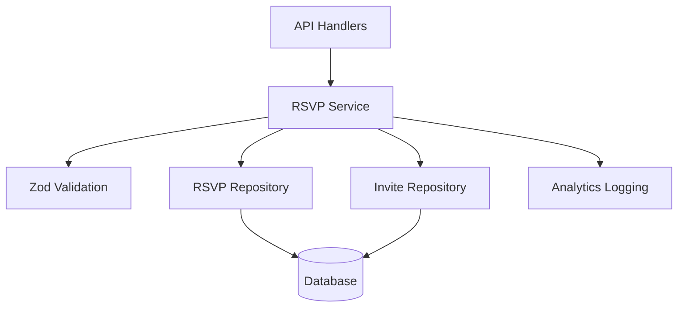

# RSVP Service Layer

The RSVP service layer provides business logic, validation, and orchestration for the RSVP system. It sits between the API handlers and repository layer, ensuring data integrity, security, and proper business rule enforcement.

## Overview

The `RSVPService` class handles all RSVP-related business operations including:
- **Public RSVP Submission** - Guest responses via invite tokens
- **Invite Management** - Creating, updating, and managing invitations
- **Data Validation** - Comprehensive input validation with Zod schemas
- **Business Logic** - Token generation, idempotency, and error handling
- **Analytics** - Structured logging for monitoring and insights

## Architecture



## Core Features

### 🔒 **Security & Validation**
- **Input Sanitization** - All inputs validated with Zod schemas
- **Token Security** - Cryptographically secure invite tokens
- **Email Privacy** - Email masking in logs for privacy protection
- **User Isolation** - All operations scoped to authenticated users

### ⚡ **Performance & Reliability**
- **Idempotency** - Duplicate RSVP submissions handled gracefully
- **Atomic Operations** - Repository operations ensure data consistency
- **Error Handling** - Comprehensive error catching and structured responses
- **Retry Logic** - Token collision handling with automatic retry

### 📊 **Business Logic**
- **Invite Validation** - Ensures invite tokens are valid and active
- **Data Normalization** - Email lowercase, country code uppercase
- **Bulk Operations** - Efficient batch invite creation with partial failure handling
- **Statistics** - Real-time RSVP statistics and reporting

## Public Methods

### RSVP Operations

#### `submitRSVP(data: unknown)`
**Public endpoint** - Handles guest RSVP submissions without authentication.

```typescript
const result = await rsvpService.submitRSVP({
  inviteId: 'token123',
  email: 'guest@example.com',
  status: 'accepted',
  partySize: 2,
  notes: 'Looking forward to celebrating!'
})

if (result.success) {
  console.log('RSVP submitted:', result.data)
} else {
  console.error('Error:', result.error)
}
```

**Features:**
- ✅ Validates invite token exists and is active
- ✅ Comprehensive input validation with Zod
- ✅ Idempotent operations (duplicate submissions update existing)
- ✅ Structured error responses with appropriate HTTP codes
- ✅ Analytics logging with masked email addresses

#### `getStats(userId: string)`
**Authenticated** - Returns RSVP statistics for dashboard display.

```typescript
const result = await rsvpService.getStats('user-123')

if (result.success) {
  const stats = result.data
  console.log(`Total RSVPs: ${stats.total}`)
  console.log(`Accepted: ${stats.accepted}`)
  console.log(`Total Guests: ${stats.totalGuests}`)
}
```

#### `listRSVPs(userId: string, filters: unknown)`
**Authenticated** - Lists RSVPs with filtering and pagination.

```typescript
const result = await rsvpService.listRSVPs('user-123', {
  status: 'accepted',
  limit: 20,
  offset: 0
})

if (result.success) {
  console.log(`Found ${result.data.total} RSVPs`)
  console.log(`Showing ${result.data.rsvps.length} results`)
}
```

### Invite Management

#### `createInvite(userId: string, data: unknown)`
**Authenticated** - Creates a new invitation with unique token.

```typescript
const result = await rsvpService.createInvite('user-123', {
  email: 'guest@example.com',
  country: 'NG'
})

if (result.success) {
  const invite = result.data
  console.log(`Invite created with token: ${invite.token}`)
  console.log(`RSVP URL: /rsvp/${invite.token}`)
}
```

**Features:**
- ✅ Generates cryptographically secure unique tokens
- ✅ Handles token collisions with automatic retry
- ✅ Normalizes email (lowercase) and country code (uppercase)
- ✅ Validates email format and country code length

#### `createBulkInvites(userId: string, data: unknown)`
**Authenticated** - Creates multiple invitations in batch.

```typescript
const result = await rsvpService.createBulkInvites('user-123', {
  invites: [
    { email: 'guest1@example.com', country: 'NG' },
    { email: 'guest2@example.com', country: 'US' },
    { email: 'guest3@example.com' }
  ]
})

if (result.success) {
  console.log(`Created ${result.data.length} invites`)
}
```

**Features:**
- ✅ Validates up to 50 invites per batch
- ✅ Handles partial failures gracefully
- ✅ Returns successful invites even if some fail
- ✅ Detailed error reporting for failed invites

#### `listInvites(userId: string, filters: unknown)`
**Authenticated** - Lists invitations with search and pagination.

```typescript
const result = await rsvpService.listInvites('user-123', {
  search: 'example.com',
  limit: 25,
  offset: 0
})
```

#### `updateInvite(userId: string, inviteId: string, data: unknown)`
**Authenticated** - Updates invitation details.

```typescript
const result = await rsvpService.updateInvite('user-123', 'invite-456', {
  email: 'newemail@example.com',
  country: 'US'
})
```

#### `deleteInvite(userId: string, inviteId: string)`
**Authenticated** - Deletes invitation and associated RSVPs.

```typescript
const result = await rsvpService.deleteInvite('user-123', 'invite-456')
```

#### `getInviteByToken(token: string)`
**Public** - Retrieves invite details for RSVP page display.

```typescript
const result = await rsvpService.getInviteByToken('token123')

if (result.success && result.data) {
  console.log(`Invite for: ${result.data.email}`)
} else {
  console.log('Invalid or expired invite')
}
```

## Validation Schemas

### Input Validation

All service methods use Zod schemas for comprehensive input validation:

```typescript
// RSVP submission validation
const RSVPSubmissionSchema = z.object({
  inviteId: z.string().uuid('Invalid invite ID format'),
  email: z.string().email('Invalid email format').toLowerCase(),
  status: z.enum(['pending', 'accepted', 'declined']),
  partySize: z.number().int().min(1).max(10).default(1),
  notes: z.string().max(500).optional().transform(val => val?.trim())
})

// Invite creation validation
const InviteCreateSchema = z.object({
  email: z.string().email().toLowerCase(),
  country: z.string().length(2).toUpperCase().optional(),
  notes: z.string().max(200).optional().transform(val => val?.trim())
})
```

### Validation Features

- **Email Normalization** - Automatically converts to lowercase
- **Country Code Normalization** - Converts to uppercase ISO format
- **String Trimming** - Removes whitespace from text fields
- **Length Limits** - Prevents excessively long inputs
- **Type Coercion** - Converts strings to numbers where appropriate
- **Custom Error Messages** - User-friendly validation error messages

## Error Handling

### Error Structure

All methods return consistent `RSVPServiceResult<T>` with structured errors:

```typescript
interface RSVPServiceResult<T> {
  success: boolean
  data?: T
  error?: {
    message: string
    code: string
    statusCode: number
  }
}
```

### Error Codes

| Code | Status | Description |
|------|--------|-------------|
| `RSVP_VALIDATION_FAILED` | 400 | Invalid RSVP submission data |
| `INVALID_INVITE` | 404 | Invite token not found or expired |
| `INVITE_VALIDATION_FAILED` | 500 | Failed to validate invite token |
| `RSVP_SAVE_FAILED` | 500 | Failed to save RSVP to database |
| `RSVP_STATS_FAILED` | 500 | Failed to retrieve RSVP statistics |
| `INVITE_CREATE_FAILED` | 500 | Failed to create invitation |
| `INVITE_NOT_FOUND` | 404 | Invitation not found for update/delete |
| `BULK_INVITE_VALIDATION_FAILED` | 400 | Invalid bulk invite data |
| `BULK_INVITE_ALL_FAILED` | 400 | All invites in batch failed |

### Error Handling Patterns

```typescript
// Input validation errors
if (!validation.success) {
  return createErrorResult(
    'Invalid RSVP data',
    'RSVP_VALIDATION_FAILED',
    400
  )
}

// Repository operation errors
if (!result.success) {
  return createErrorResult(
    'Failed to save RSVP',
    'RSVP_SAVE_FAILED',
    500
  )
}

// Business logic errors
if (!inviteResult.data) {
  return createErrorResult(
    'Invalid or expired invite',
    'INVALID_INVITE',
    404
  )
}
```

## Business Logic

### Token Generation

Secure token generation with collision handling:

```typescript
private async generateUniqueToken(): Promise<string> {
  let attempts = 0
  const maxAttempts = 5

  while (attempts < maxAttempts) {
    // Generate cryptographically secure token
    const token = randomBytes(16).toString('hex')
    
    // Check uniqueness
    const uniqueResult = await this.inviteRepo.isTokenUnique(token)
    
    if (uniqueResult.success && uniqueResult.data) {
      return token
    }

    attempts++
  }

  // Fallback with timestamp
  return `${Date.now()}_${randomBytes(8).toString('hex')}`
}
```

### Email Privacy Protection

Email addresses are masked in logs to protect privacy:

```typescript
private maskEmail(email: string): string {
  const [local, domain] = email.split('@')
  if (local.length <= 2) {
    return `${local[0]}***@${domain}`
  }
  return `${local.slice(0, 2)}***@${domain}`
}

// Usage in logging
console.log('RSVP submitted', {
  userId: invite.userId,
  email: this.maskEmail(rsvpData.email), // guest@example.com -> gu***@example.com
  status: rsvpData.status,
  operation: 'rsvp_submit'
})
```

### Idempotency Handling

RSVP submissions are idempotent - duplicate submissions update existing records:

```typescript
// Service orchestrates idempotent repository operation
const rsvpCreateData = {
  userId: invite.userId,
  inviteId: invite.id,
  email: rsvpData.email,
  status: rsvpData.status,
  partySize: rsvpData.partySize,
  notes: rsvpData.notes
}

// Repository handles upsert with userId+email unique constraint
const result = await this.rsvpRepo.createOrUpdate(rsvpCreateData)
```

## Analytics & Logging

### Structured Logging

All operations include structured logging for analytics:

```typescript
// RSVP submission logging
console.log('RSVP submitted', {
  userId: invite.userId,
  inviteId: invite.id,
  email: this.maskEmail(rsvpData.email),
  status: rsvpData.status,
  partySize: rsvpData.partySize,
  operation: 'rsvp_submit'
})

// Invite creation logging
console.log('Invite created', {
  userId,
  inviteId: result.data.id,
  email: this.maskEmail(inviteData.email),
  country: inviteData.country,
  operation: 'invite_create'
})
```

### Monitoring Metrics

Key metrics to track from service logs:

- **RSVP Submission Rate** - `operation: 'rsvp_submit'`
- **Invite Creation Rate** - `operation: 'invite_create'`
- **Validation Failures** - Error codes starting with `VALIDATION_FAILED`
- **Invalid Invites** - `INVALID_INVITE` error frequency
- **Bulk Operation Success** - Partial vs complete failures in bulk operations

## Testing

### Unit Test Coverage

**File**: `__tests__/rsvp.service.test.ts`

- ✅ **submitRSVP** - Valid submissions, validation errors, invalid invites, repository errors
- ✅ **getStats** - Successful retrieval, repository errors
- ✅ **createInvite** - Valid creation, validation errors, token collisions, normalization
- ✅ **listRSVPs** - Pagination, filtering, validation errors
- ✅ **createBulkInvites** - Successful batch, partial failures, validation errors
- ✅ **updateInvite** - Successful updates, validation errors, not found scenarios
- ✅ **deleteInvite** - Successful deletion, not found scenarios
- ✅ **getInviteByToken** - Valid tokens, invalid tokens

### Test Scenarios

```typescript
// Example test case
it('should successfully submit RSVP with valid data', async () => {
  mockInviteRepo.getByToken.mockResolvedValue({ success: true, data: mockInvite })
  mockRSVPRepo.createOrUpdate.mockResolvedValue({ success: true, data: mockRSVP })

  const result = await service.submitRSVP(validRSVPData)

  expect(result.success).toBe(true)
  expect(result.data).toEqual(mockRSVP)
})
```

### Running Tests

```bash
# Validate service structure
node src/features/rsvp/service/__tests__/test-runner.js

# Run unit tests (requires test framework)
npm run test:unit -- rsvp.service

# Run integration tests with real repositories
npm run test:integration -- rsvp
```

## Integration Points

### API Layer Integration

The service is designed to be consumed by API handlers:

```typescript
// Example API handler usage
export class RSVPHandler {
  private service = new RSVPService()

  async submitRSVP(request: NextRequest): Promise<NextResponse> {
    const body = await request.json()
    const result = await this.service.submitRSVP(body)
    
    if (!result.success) {
      return NextResponse.json({
        success: false,
        error: result.error
      }, { status: result.error?.statusCode || 500 })
    }

    return NextResponse.json({
      success: true,
      data: result.data
    }, { status: 201 })
  }
}
```

### Repository Layer Integration

The service orchestrates multiple repositories:

```typescript
constructor() {
  this.rsvpRepo = new RSVPRepository()
  this.inviteRepo = new InviteRepository()
}

// Example orchestration
async submitRSVP(data: unknown) {
  // 1. Validate input
  const validation = validateRSVPSubmission(data)
  
  // 2. Validate invite
  const inviteResult = await this.inviteRepo.getByToken(rsvpData.inviteId)
  
  // 3. Create/update RSVP
  const result = await this.rsvpRepo.createOrUpdate(rsvpCreateData)
  
  // 4. Log analytics
  console.log('RSVP submitted', { ... })
}
```

## Performance Considerations

### Efficient Operations

- **Single Repository Calls** - Most operations use single repository method calls
- **Batch Processing** - Bulk invites processed efficiently with error collection
- **Lazy Validation** - Input validation happens before expensive repository operations
- **Minimal Data Transfer** - Only required fields passed between layers

### Caching Opportunities

- **Invite Token Validation** - Frequently accessed invites could be cached
- **RSVP Statistics** - Dashboard stats could be cached with TTL
- **User Invite Lists** - Paginated results could benefit from caching

### Scaling Considerations

- **Stateless Operations** - All methods are stateless and can be horizontally scaled
- **Repository Abstraction** - Can easily switch to different data stores
- **Async Operations** - All database operations are async for better concurrency

## Security Considerations

### Input Sanitization

- **Zod Validation** - All inputs validated with strict schemas
- **Email Normalization** - Prevents case-sensitivity issues
- **Length Limits** - Prevents buffer overflow and DoS attacks
- **Type Safety** - TypeScript ensures type correctness

### Privacy Protection

- **Email Masking** - Email addresses masked in logs
- **User Scoping** - All operations scoped to authenticated users
- **Token Security** - Cryptographically secure invite tokens
- **No Sensitive Logging** - Personal data not logged in plain text

### Access Control

- **Authentication Required** - Most operations require user authentication
- **User Isolation** - Users can only access their own data
- **Public Endpoints** - Only RSVP submission and invite lookup are public
- **Token-Based Access** - Public operations use secure tokens for authorization

## Future Enhancements

### Potential Improvements

1. **Real-time Updates** - WebSocket support for live RSVP updates
2. **Email Templates** - Integration with email service for invite sending
3. **Advanced Analytics** - More detailed RSVP analytics and reporting
4. **Bulk Operations** - More efficient bulk processing with database transactions
5. **Caching Layer** - Redis integration for frequently accessed data

### API Extensions

1. **RSVP History** - Track RSVP changes over time
2. **Invite Expiration** - Support for time-limited invites
3. **Custom Fields** - Additional RSVP fields (dietary restrictions, etc.)
4. **Guest Groups** - Support for household/family groupings
5. **Reminder System** - Automated RSVP reminders

This service layer provides a robust, secure, and scalable foundation for the RSVP system with comprehensive validation, error handling, and business logic implementation.